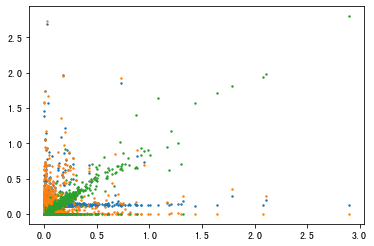

- [2021-1-3](#2021-1-3)
  - [PLAN](#plan)
  - [UTHealth 面试准备](#uthealth-面试准备)
    - [讲稿修改](#讲稿修改)
    - [研究兴趣](#研究兴趣)
    - [潜在教授](#潜在教授)
- [2022-1-4](#2022-1-4)
  - [PLAN](#plan-1)
  - [方差分析](#方差分析)
  - [文献阅读](#文献阅读)
    - [结果](#结果)
- [2022-1-5](#2022-1-5)
  - [PLAN](#plan-2)
- [2022-1-6](#2022-1-6)
  - [PLAN](#plan-3)
  - [微生物主旨](#微生物主旨)
- [2022-1-7](#2022-1-7)
  - [PLAN](#plan-4)
  - [单细胞进度](#单细胞进度)
    - [Pre-Training](#pre-training)
  - [微生物](#微生物)
    - [Result](#result)
    - [Discussion](#discussion)
  - [统计学习](#统计学习)
    - [分布复习](#分布复习)
    - [检验](#检验)
- [2022-1-8](#2022-1-8)
  - [PLAN](#plan-5)
  - [单细胞](#单细胞)
    - [单细胞数据检查](#单细胞数据检查)
    - [模型进度](#模型进度)
  - [人类hsc](#人类hsc)
- [2022-1-9](#2022-1-9)
  - [PLAN](#plan-6)
  - [单细胞可视化](#单细胞可视化)
  - [微生物论文](#微生物论文)
    - [Graphical Abstract](#graphical-abstract)
  - [CellOracle](#celloracle)
    - [Summary](#summary)
    - [造血细胞研究](#造血细胞研究)
- [2022-1-10](#2022-1-10)
  - [PLAN](#plan-7)
  - [tmux滚轮](#tmux滚轮)
  - [LTR 学习内容](#ltr-学习内容)
- [2022-1-11](#2022-1-11)
  - [PLAN](#plan-8)
  - [转录因子重建问题](#转录因子重建问题)
- [2022-1-12](#2022-1-12)
  - [PLAN](#plan-9)
  - [LTR研究](#ltr研究)
    - [基因破坏和表观遗传控制](#基因破坏和表观遗传控制)
  - [LTR进化分析](#ltr进化分析)
  - [LTR 结构](#ltr-结构)
- [2022-1-13](#2022-1-13)
  - [PLAN](#plan-10)
  - [统计学学习](#统计学学习)
    - [单因素配对方差检验](#单因素配对方差检验)
    - [双因素方差检验](#双因素方差检验)
  - [微生物文章定稿](#微生物文章定稿)
  - [GBE文章](#gbe文章)
    - [重点](#重点)
    - [推荐阅读文章](#推荐阅读文章)
  - [进化树复习](#进化树复习)
    - [非概率论方法](#非概率论方法)
- [2022-1-14](#2022-1-14)
  - [PLAN](#plan-11)
- [2022-1-15](#2022-1-15)
  - [PLAN](#plan-12)
  - [单细胞结果overview](#单细胞结果overview)
  - [pre-training (Transforming Learning)](#pre-training-transforming-learning)
    - [tricks](#tricks)
    - [encoder](#encoder)
    - [decoder](#decoder)
  - [拟南芥项目规划](#拟南芥项目规划)
    - [Yijia Liu's TASK](#yijia-lius-task)

# 2021-1-3

## PLAN
+ **毕业设计修改**
+ **分子生物学复习**
+ **面试准备**

## UTHealth 面试准备

### 讲稿修改

+ 修改下菠菜研究的细节

### 研究兴趣

+ 单细胞、脑胶质瘤的开发 、
+ 基因组学 变异等
+ microbiome
+ VAE

### 潜在教授

+ Akdes Serin-Harmanci
  + https://www.nature.com/articles/ncomms14433
  + 脑胶质瘤和单细胞的兴趣

+ Jacqueline Chyr
  +  1) 癌症基因组中的选择性剪接和多聚腺苷酸化，
  +  2) 影响增强子-启动子相互作用的 3D 基因组组织的大规模和小规模分析
  +  3) 系统生物学和肠道微生物组代谢-代谢物网络建模
  +  4) 开发用于生物医学数据分析的 AI 工具。

# 2022-1-4

## PLAN
+ **分子生物学复习**
+ **ppt修改**
+ **文献阅读**
+ **统计学学习**

## 方差分析

$$F = \frac{组间方差/自由度}{组内方差/自由度}$$

## 文献阅读

*高级别胶质瘤谱系多样性的单细胞转录组分析*

网站 https://genomemedicine.biomedcentral.com/articles/10.1186/s13073-018-0567-9

### 结果

Figure1 


通过聚类并进行分类

通过染色体异倍型进行PCA降维

通过染色体异倍型对于transformed程度进行打分

e展示异常倍性

**判断转化细胞从marker基因和染色体拷贝数判断**

Figure2


sox2 是Transformed cells的标志

# 2022-1-5

## PLAN
+ **分子生物学**
+ **面试**


# 2022-1-6

## PLAN
+ **微生物图片定稿**
+ **微生物结果改写**

## 微生物主旨

**氮肥和植物协同促进hitchhiking**

图一 没植物 画上氮肥微生物没有方向性
图二 加植物 画上氮肥微生物有方向性

# 2022-1-7

## PLAN
+ **单细胞进度**
+ **Result**
+ **模式图商议**
+ **整理工作思路**
+ **统计学学习**

## 单细胞进度

> 老鼠HSC数据集

最先计划 新数据集已有pipeline做训练(**在现有的network 正则化**)

### Pre-Training 

在现有的network 正则化 主要做 decoder 


## 微生物

### Result

完成了堆叠图、多样性以及功能、相关性图的描述。

**堆叠图**和**多样性**分析中修改较多

### Discussion

+ Bacillus 没菜没区别 加植物有区别 证明会影响Bacillus 影响细胞运动 影响hitchhiking
+ 通过加了植物后 不同氮肥下 Bacillus 不一样 中等浓度最高 **适量氮肥和植物促进Bacillus** 浓度过高 浓度过低的氮肥影响Bacillus运动
+ 结论 协同共同作用hitchhiking

另一段

+ 氮肥会促进植物生长 我们的结果表明了这个观点 植物生长图
+ 以往认为的原因 1 2 3 
+ 除了这些原因外 通过我们的实验，在加膜后，之间没有差异了（摆结果） 可能通过影响 hitchhiking 
+ 可以得出hitchhiking 促进植物生长

## 统计学习

### 分布复习


均值 正态 z分布 t分布

方差 卡方分布 自由度n-1

比例 t分布

相关系数 正态分布 t分布

### 检验


参数检验 样本量大 总体封据服从正态分布小样本服从分布

非参数 不要求总体分布 品质数据
品质数据往往不是随机变量 由好 很好 差等离散定序数据组成


# 2022-1-8

## PLAN
+ **微生物论文Discussion完成**
+ **单细胞数据检查**
+ **文献阅读**

## 单细胞

### 单细胞数据检查

mouse 数据 /home/ubuntu/data/insilico_pretrubation_data/mouse_epistasis_all.csv

human 数据 /home/ubuntu/data/insilico_pretrubation_data/human_epistasis_all.csv
/home/ubuntu/data/insilico_pretrubation_data/human_epistasis_gene.csv
/home/ubuntu/data/insilico_pretrubation_data/human_epistasis_cell_type.csv

### 模型进度

+ 已修改decoder模型
+ 未添加正则化

## 人类hsc

分化路径 层次


尚在问题 是否可以只调一个转录因子

成熟细胞和祖细胞关系


# 2022-1-9

## PLAN
+ **单细胞可视化**
+ **文献阅读**
+ **微生物论文定稿审查**

## 单细胞可视化

问题 从tfs -> genes 的tsne umap降维效果不好

**double check tf的顺序**

## 微生物论文

### Graphical Abstract
初稿修订完毕


## CellOracle

### Summary
在这里，我们介绍了 CellOracle，这是一种计算工具，它集成了单细胞转录组和表观基因组谱，以推断基因调控网络 (GRN)，这是细胞身份的关键调控因子。利用推断的 GRN，**我们模拟了响应转录因子 (TF) 扰动的基因表达变化**，使网络配置能够在计算机上进行询问，方便他们的解释。**我们验证了 CellOracle 的功效，可以概括造血过程中已知的调节变化，正确预测特征明确的 TF 扰动的结果**。将 CellOracle 分析与直接重编程的谱系追踪相结合，揭示了不同重编程故障模式下的不同网络配置。此外，沿着成功的重编程轨迹分析 GRN 重配置确定了提高靶细胞产量的新因素，揭示了 AP-1 亚基 Fos 与河马信号效应器 Yap1 的作用。总之，这些结果证明了 CellOracle 以高分辨率推断和解释细胞类型特异性 GRN 配置的功效，促进了对细胞身份调节和重编程的新机制见解

### 造血细胞研究


# 2022-1-10

## PLAN
+ **微生物论文定稿**

## tmux滚轮

ctrl+B [ 即可正常使用

## LTR 学习内容

+ 3'LTR 5'LTR 末端重复序列 根据这识别
+ 判断失活TE **用进化树聚类分析**

# 2022-1-11

## PLAN
+ 单细胞问题

## 转录因子重建问题



蓝色 encoder 后隐藏层
橙色 隐藏层的交互层
绿色 输出层转录因子


# 2022-1-12

## PLAN
+ **LTR 结构研究**
+ **G4 甲基化统计**
+ **LTR初步设计**
+ **微生物文章**

## LTR研究

### 基因破坏和表观遗传控制

**外显子、内含子插入**

**通读转录**

**表观遗传学破坏**

## LTR进化分析

ML树 分析 $K_{ST}$数 进行评估等

详见GBE文献

## LTR 结构
LTR 反转录转座子具有直接的 长末端重复序列，其大小范围从 ~100 bp 到超过 5 kb。反转录转座子LTR是进一步亚分类为Ty1- COPIA样（假病毒科），Ty3-吉普赛样（转座病毒科），和BEL-报样（Belpaoviridae基于两种其序列相似性程度和的顺序）基团编码的基因产物。Ty1- COPIA和Ty3-吉普赛反转录转座子的群体在高拷贝数（最多通常发现每几百万份单倍体 核) 在动物、真菌、原生生物和植物基因组中。迄今为止，仅在动物中发现了类似 BEL-Pao 的元素。

所有功能性 LTR 逆转录转座子至少编码两个基因，gag和pol，它们足以进行复制。Gag编码具有衣壳和核衣壳结构域的多蛋白。Gag 蛋白在细胞质中形成病毒样颗粒，在其中发生逆转录。的波尔基因产生三种蛋白：一个蛋白酶（PR），一个逆转录酶赋予一个RT（逆转录酶）和RNA酶H结构域，和一个整合（IN）。

通常，LTR 逆转录转座子 mRNA 是由宿主RNA pol II作用于位于其 5' LTR 中的启动子产生的。Gag 和 Pol 基因编码在相同的 mRNA 中。根据宿主物种的不同，可以使用两种不同的策略来表达这两种多蛋白：融合成一个开放阅读框 (ORF)，然后将其切割或在两个 ORF 之间引入移码。偶尔的核糖体移码允许产生两种蛋白质，同时确保产生更多的 Gag 蛋白以形成病毒样颗粒。

逆转录通常起始于紧邻 5'-LTR 下游的短序列，称为引物结合位点(PBS)。特定的宿主tRNA与 PBS 结合并充当逆转录的引物，逆转录发生在一个复杂的多步骤过程中，最终产生双链cDNA分子。cDNA 最终被整合到一个新位置，创建了短的 TSD（目标位点重复），并在宿主基因组中添加了一个新副本

# 2022-1-13

## PLAN
+ **微生物文章定稿**
+ **文献阅读**
+ **进化树复习**
+ **统计学学习**

## 统计学学习

### 单因素配对方差检验

组间/组内

组内需要细分需要消除个体间差异 例子 组内差异营销出病人本身指标的因素，可能某些组内差异是由于病人在用药前的指标就有差异

**自由度确定**

组间 总数据（组数个组平均即组数）-平均数（总平均1）

组内 总数据（总数据数）-平均数个数（组数）

### 双因素方差检验

**数据类型**
水平1 水平A 样本
水平1 水平B 样本
水平2 水平A 样本
水平2 水平B 样本

组内变异计算正常计算

组间变异 需要计算A因素 B因素分别算+交互因素

再分别做检验

**自由度**

A/B 因素方差自由度计算 因素均值-总均值 自由度=因素数-平均值数(总均值)
交互效应 A水平数*B水平数-1-A因素自由度-B因素自由度

## 微生物文章定稿

+ 还差discussion 最后一个部分
+ 图的图注
+ 文章中图标记
+ abstract

## GBE文章

### 重点
+	进化树可视化分型
+	利用多指标判断是否失话

### 推荐阅读文章


+ NAR Quadruplex-forming sequences occupy discrete regions inside plant LTR retrotransposons

+ NAR Whole genome experimental maps of DNA G-quadruplexes in multiple species

+ Nature structural & molecular biology https://doi.org/10.1038/ s41594-018-0131-8.

+ Cell http://dx.doi.org/10.1016/j.cell.2016.06.044

+ scientific report https://doi.org/10.1038/s41598-017-14017-4

+ gene http://dx.doi.org/10.1016/j.gene.2017.04.051

+ gbe Evolutionary Dynamics of Retrotransposons Assessed by High-Throughput Sequencing in Wild Relatives of Wheat

## 进化树复习

### 非概率论方法

邻接法（为解决分子钟速率不一致问题） umpga

简约法 用最少碱基替换数目解释 包括确定罚值以及搜索全局最小值


# 2022-1-14

## PLAN
+ **图注**
+ **摘要**

# 2022-1-15

## PLAN
+ **单细胞结果overview**
+ **预训练学习**
+ **微生物结果整合，检查**
+ **拟南芥项目规划**
+ **文献阅读 (cell oracle)**

## 单细胞结果overview
依然无法解决中间层 tf恢复较差的问题

## pre-training (Transforming Learning)

### tricks

Fine-tuning

+ 更小学习率
+ 较少数据迭代
+ 底层更加通用

### encoder

**未设置正则化项**

```py
from functools import reduce
from pickle import load
import torch
import numpy as np
import torch.nn.functional as F
from torch import  nn, optim
import scanpy as sc
from scipy import sparse
import pandas as pd
import Custom_dataLoader
import VAE_model
from torch.utils.data import DataLoader
from early_stop import EarlyStopping
import wandb

adata = sc.read_h5ad("/home/ubuntu/MLPackageStudy/VAE/in-silico/model_Version_2/hsc_anndata_human.h5ad")
gene_names = list(adata.var['gene_symbol'])
adata.obs['cell_type']=adata.obs_names
f = open('/home/ubuntu/MLPackageStudy/VAE/tf-homo-current-symbol.dat','rb')
tfs = f.read()
tfs = str(tfs,encoding='utf-8')
tfs = tfs.split('\r\n')
tfs_hsc_human = set(gene_names) & set(tfs)
tfs_hsc_human = list(tfs_hsc_human)

wandb.init(project="my-test-project", entity="pry2000")
wandb.config = {
"learning_rate": 1e-5,
"batch_size": 128
}

batch_size = 128
learning_rate = 1e-4
patience = 20
data_z_genes = adata.X
data_z = adata[:,tfs_hsc_human].X
# print(data_z_genes.values)
training_set = Custom_dataLoader.CustomDataset(torch.Tensor(np.array(data_z,dtype=np.float32)),torch.Tensor(np.array(data_z_genes,dtype=np.float32)))
training_dataloader = DataLoader(training_set,batch_size, shuffle=True)

def pre_train_loop_decoder(dataloader, model, loss_fn, optimizer,epoch):
    
    size = len(dataloader.dataset)
    loss_epoch = 0
    for batch, (X, y) in enumerate(dataloader):
        # Compute prediction and loss
        pred, _ = model(X)
        loss = loss_fn(pred, y)
        # Backpropagation
        optimizer.zero_grad()
        loss.backward()
        nn.utils.clip_grad_norm_(model.parameters(), max_norm=20, norm_type=2)
        optimizer.step()
        loss_epoch += loss.item()

    print('epoch: ', epoch, '  loss:', loss_epoch/size)
    wandb.log({"loss": loss_epoch/size})
    # Optional
    wandb.watch(model)
    return loss_epoch


model = VAE_model.Decoder_VAE(data_z_genes.shape[1],z_dim = data_z.shape[1])
optimizer = optim.Adam(model.parameters(), lr=learning_rate)
criterion = nn.MSELoss(reduction = "sum")
print(model)
early_stopping = EarlyStopping(patience=patience, verbose=True,path="/home/ubuntu/MLPackageStudy/VAE/in-silico/model_Version_2/encoder_human_checkpoint.pt")
for epoch in range(100):
    loss = pre_train_loop_decoder (training_dataloader,model,criterion, optimizer,epoch)
    model.eval()
    early_stopping(loss, model)
    if early_stopping.early_stop:
        break
```

### decoder

**代码类似但没有考虑两层TFs**

## 拟南芥项目规划

### Yijia Liu's TASK

+ 熟悉pipeline 1
+ 利用爬虫 (python) 学习如何下载 相关文件
+ 甲基化网站 https://www.ncbi.nlm.nih.gov/geo/query/acc.cgi?acc=GSE43857
+ https://www.arabidopsis.org/download/index-auto.jsp?dir=%2Fdownload_files%2FGenes%2FTAIR10_genome_release%2FTAIR10_transposable_elements 转座子库

## cell oracle


### 数据集

Hsc 数据集

### 原理

首先利用已知信息创建基础网络

再对不同类别创建特异性调控网络贝叶斯边际理论

再对特定转录因子波动 网络多次迭代达到稳态