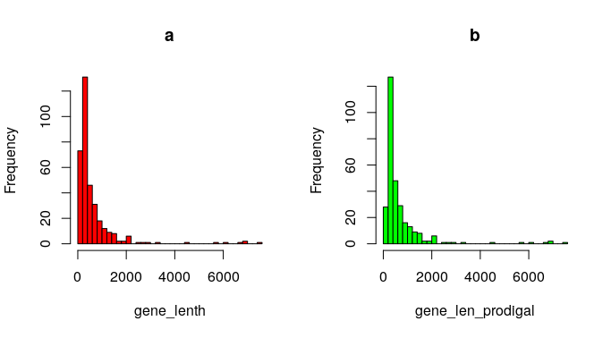
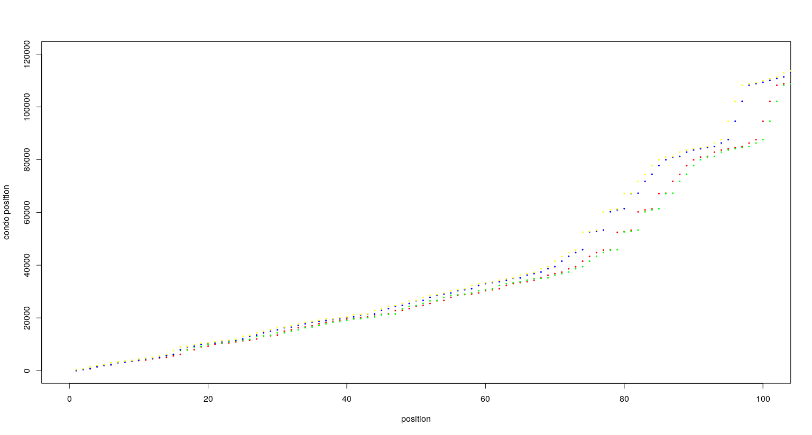
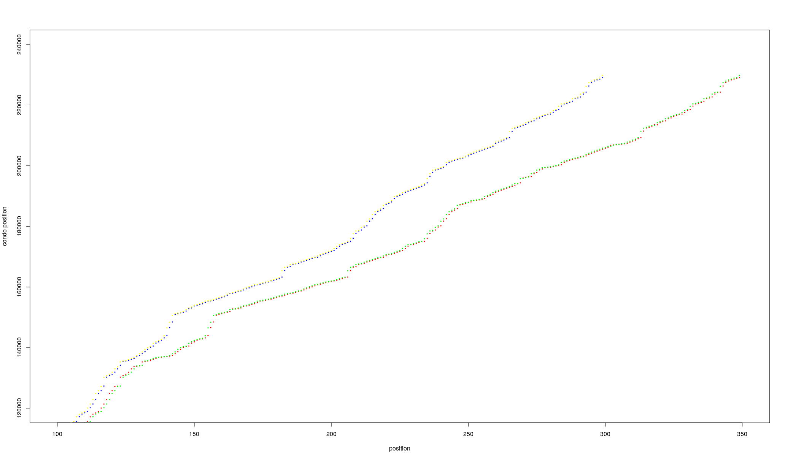
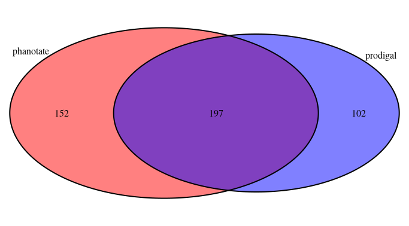
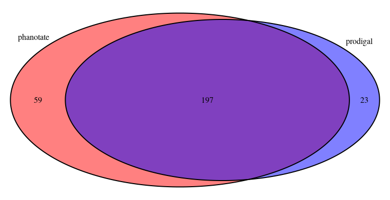

- [2021-7-1](#2021-7-1)
  - [PLAN](#plan)
  - [VirFinder](#virfinder)
    - [主要功能](#主要功能)
    - [方法](#方法)
    - [KEGG GO NOG](#kegg-go-nog)
    - [Metaboanalyst 代谢通路富集分析](#metaboanalyst-代谢通路富集分析)
- [2021-7-2](#2021-7-2)
  - [PLAN](#plan-1)
  - [病毒基因组介绍](#病毒基因组介绍)
  - [代谢组数据](#代谢组数据)
- [2021-7-3](#2021-7-3)
  - [PLAN](#plan-2)
  - [创建GitHub Gitee Blog](#创建github-gitee-blog)
  - [中科院超算使用记录](#中科院超算使用记录)
    - [登录方法](#登录方法)
    - [使用记录](#使用记录)
  - [eggNog 数据库](#eggnog-数据库)
  - [24samples 16s分析](#24samples-16s分析)
  - [微生物土壤重建文献](#微生物土壤重建文献)
    - [Key point 3](#key-point-3)
    - [下文地址](#下文地址)
- [2021-7-5](#2021-7-5)
  - [PLAN](#plan-3)
- [2021-7-6](#2021-7-6)
  - [PLAN](#plan-4)
  - [微生物土壤重建文献](#微生物土壤重建文献-1)
    - [文章简介](#文章简介)
    - [文章计算解读](#文章计算解读)
    - [NVI 介绍](#nvi-介绍)
    - [下文地址](#下文地址-1)
  - [VIGOR, an annotation program for small viral genomes](#vigor-an-annotation-program-for-small-viral-genomes)
    - [Feature of viral genes](#feature-of-viral-genes)
    - [key point](#key-point)
- [2021-7-7](#2021-7-7)
  - [PLAN](#plan-5)
  - [微生物土壤重建文献](#微生物土壤重建文献-2)
    - [OMI分析](#omi分析)
    - [扩散指数](#扩散指数)
  - [VIGOR, an annotation program for small viral genomes](#vigor-an-annotation-program-for-small-viral-genomes-1)
    - [Algorithm](#algorithm)
  - [会议记录](#会议记录)
- [2021-7-8](#2021-7-8)
  - [PLAN](#plan-6)
  - [桉树论文结果部分大纲](#桉树论文结果部分大纲)
    - [微生物组成分析](#微生物组成分析)
    - [alpha多样性比较](#alpha多样性比较)
    - [PCoA 图](#pcoa-图)
    - [KEGG热图](#kegg热图)
- [2021-7-9](#2021-7-9)
  - [PLAN](#plan-7)
  - [PHANOTATE Programming](#phanotate-programming)
    - [Problems :](#problems-)
- [2021-7-10](#2021-7-10)
  - [PLAN](#plan-8)
  - [nog分析夏季](#nog分析夏季)
    - [分布图](#分布图)
    - [氮代谢相关功能](#氮代谢相关功能)
- [2021-7-11](#2021-7-11)
  - [PLAN](#plan-9)
  - [使用VSCode调试服务器python文件](#使用vscode调试服务器python文件)
    - [先决条件](#先决条件)
    - [步骤](#步骤)
  - [pyfastax软件介绍及其安装](#pyfastax软件介绍及其安装)
    - [安装](#安装)
    - [用法](#用法)
    - [Tips](#tips)
  - [调试phanotate](#调试phanotate)
    - [在VSCode中python调试时加入参数](#在vscode中python调试时加入参数)
    - [algorithm steps](#algorithm-steps)
    - [Most time-consuming codes](#most-time-consuming-codes)
    - [Orf Creating](#orf-creating)
- [2021-7-12](#2021-7-12)
  - [PLAN](#plan-10)
  - [审稿意见回复](#审稿意见回复)
- [2021-7-13](#2021-7-13)
  - [PLAN](#plan-11)
  - [nog分析冬季](#nog分析冬季)
    - [分布图](#分布图-1)
    - [氮代谢相关功能](#氮代谢相关功能-1)
  - [get_orfs流程](#get_orfs流程)
    - [frame_plot(GCframe) add_base](#frame_plotgcframe-add_base)
    - [for-each base 21mer k=21](#for-each-base-21mer-k21)
    - [frame_plot(GCframe) get](#frame_plotgcframe-get)
    - [Calculate pstop and record start stop condos](#calculate-pstop-and-record-start-stop-condos)
    - [Reset iterator and find all the open reading frames (including overlaps)](#reset-iterator-and-find-all-the-open-reading-frames-including-overlaps)
    - [Give a score to each ORF based on rbs and GC](#give-a-score-to-each-orf-based-on-rbs-and-gc)
- [2021-7-14](#2021-7-14)
  - [PLAN](#plan-12)
  - [get_graph流程](#get_graph流程)
    - [creat all the Nodes and  Edge](#creat-all-the-nodes-and--edge)
    - [Check for long noncoding regions that would break the path](#check-for-long-noncoding-regions-that-would-break-the-path)
    - [Connect the open reading frames to each other](#connect-the-open-reading-frames-to-each-other)
    - [Minimal path algorithm](#minimal-path-algorithm)
    - [What we can imporove](#what-we-can-imporove)
- [2021-7-15](#2021-7-15)
  - [度假](#度假)
  - [突变](#突变)
- [2021-7-17](#2021-7-17)
  - [PLAN](#plan-13)
- [2021-7-18](#2021-7-18)
  - [PLAN](#plan-14)
- [2021-7-19](#2021-7-19)
  - [PLAN](#plan-15)
  - [Zhejiang University 感悟](#zhejiang-university-感悟)
- [2021-7-20](#2021-7-20)
  - [PLAN](#plan-16)
  - [Overview Yifei Huang Lab](#overview-yifei-huang-lab)
- [2021-7-21](#2021-7-21)
  - [PLAN](#plan-17)
  - [phage可视化](#phage可视化)
  - [Abstract 结构](#abstract-结构)
- [2021-7-22](#2021-7-22)
- [PLAN](#plan-18)
- [phage基因组做出散点图](#phage基因组做出散点图)
- [2021-7-23](#2021-7-23)
  - [PLAN](#plan-19)
  - [对LC597490相同基因做出VENN图](#对lc597490相同基因做出venn图)
    - [All the genes](#all-the-genes)
    - [+ STRAND](#-strand)
  - [Potential parallel part for phanotate](#potential-parallel-part-for-phanotate)
- [2021-7-24](#2021-7-24)
  - [PLAN](#plan-20)
  - [Potential LAN](#potential-lan)
  - [Research Proposal](#research-proposal)
    - [Statement of Purpose](#statement-of-purpose)
  - [群体遗传学习](#群体遗传学习)
    - [归纳法induction和演绎法deduction并用的实践过程。](#归纳法induction和演绎法deduction并用的实践过程)
    - [名词介绍](#名词介绍)
    - [选型交配 assortative mating](#选型交配-assortative-mating)
    - [配子不平衡](#配子不平衡)
- [2021-7-25](#2021-7-25)
  - [PLAN](#plan-21)
  - [ML学习计划](#ml学习计划)
# 2021-7-1
## PLAN
+ **VirFinder 文献阅读**
+ **KEGG丰度图**
+ **16S结论总结(桉树)**
+ **Metaboanalyst 代谢通路使用说明总结**
+ **GRE阅读2填空3**

## VirFinder
### 主要功能
将contig or read 宏基因组测序后将病毒和宿主的基因组进行分箱Bin
### 方法
+ Use t statistic to test for each word w if the mean word frequency in viral sequences was significantly different from that in host sequences.
+ Exclude the word whose p value is the highest
+ Use Logistic Regression and Lasso Regression to train and predict

### KEGG GO NOG
可以取平均作图，可以去异常值，注意交换数据，做出热图，并找到显著性检验功能，写到论文中。

### Metaboanalyst 代谢通路富集分析
可以直接输入name并寻求对应和作图

# 2021-7-2
## PLAN
+ **GRE阅读2填空3**
+ **修改根际微生物图**
+ **整理代谢组数据**
+ **搜索病毒基因组数据**

## 病毒基因组介绍
+ 与真核生物相比，基因组size较小
+ 形态多样，单链双链线性
+ 基因重叠现象明显
    + 一个基因在另一个基因中
    + 两个基因相交
    + 两个基因之间只有一个nt相交、即一个基因的start condo和零一个基因的stop condo只有一个密码子相交
+ 大部分区域都编码蛋白质
+ Phage的特点
    + 连续无内含子 而真核生物病毒含有内含子
    + GC content 34%
+ introns Some fragments of introns are introns for some genes, however, when considering the overlaps the regions may become exons

## 代谢组数据
进入 http://42.193.18.116:8080/MetaboAnalyst/
+ 对于通路分析对应网站: Enrichment Analysis
    + 首先需要整理数据，数据表头需要KEGG_ID，每一个sample对应的分组，一个分组至少要有三个重复
    + 对于富集分析只能进行两组间比较
    
# 2021-7-3
## PLAN
+ **整理病毒基因组特征文献并且下载文献管理软件Mendeley**
+ **在github创建个人日志管理系统**
+ **GRE 阅读一套题**
+ **尝试超算使用**
+ 阅读土壤物种重建文章
## 创建GitHub Gitee Blog
+ Github网址 https://github.com/YangyiLab/Daily-Worklog
+ 码云 令牌 4ffb557087446dc944151a59d1beb9ba
  项目地址: https://gitee.com/YangyiLab/Daily-Worklog

## 中科院超算使用记录
### 登录方法
请点击链接 https://cloud.blsc.cn/ 下载客户端,  使用下列北京超级云计算中心账号登陆；
北京超级云计算中心登录账号 | 用户名：princeyuansql@gmail.com 密码：a182d9
### 使用记录
+ 可以使用基本文件操作
+ 可以使用基本账号密码登录(需要单独申请)
+ 跑代码比较合适(但需要单独编写任务提交命令sbatch等)
**需要编写sbatch脚本和.job脚本**

## eggNog 数据库
+ 导入两张表
+ 做自然连接/Where 到处一张表 Orthologous_id	Orthologous_id_description	Class
+ Group by 命令 统计下 Class的数量
+ 导出到excel表中，按照class排序，找到和nitrogen相关的基因

## 24samples 16s分析
+ aplha 多样性
+ beta 多样性 (需要利用commandLine函数辅助)
+ 相对丰度图

## 微生物土壤重建文献
<span id="BS-D1">文献地址 https://doi.org/10.1038/s41467-020-20271-4 </span>
### Key point 3
+ Body size
+ Community assembly processes of soil organisms in paddy system
+ Distance-decay relationship and variation

### 下文地址
下文地址 **[section-2](#微生物土壤重建文献-1)**

# 2021-7-5
## PLAN 
+ **修改土壤微生物论文 定稿**
+ **GRE阅读3填空1**
+ 修改简历

# 2021-7-6
## PLAN 
+ **修改土壤微生物论文图片引用**
+ **GRE阅读3填空1**
+ 病毒微生物综述阅读
+ **土壤重建论文继续阅读**

## 微生物土壤重建文献
上文地址: **[section-1](#微生物土壤重建文献)**
### 文章简介
本文主要通过探究体型大小揭示生物体型大小在生物群落构建机制中的作用>
生物生物体型与**丰富度**、**扩散速率**和**生态位宽度**负相关，从而影响了生物群落的周转率。

### 文章计算解读
+ 丰富度 alpha多样性
+ 扩散速率 DDR Distance-decay relationship
  比较方式包括Similarity BC ~ 地理距离Distance
  $\log S =a+b \log D$
  $S_0$与body size关系 以及$b$斜率指标和body size关系

$S_0$计算方法，文章中选用了45个采样点，每个采样点进行分箱，分出不同的class级别物种，此时拥有了class级别物种的body size，在更加细分，可以计算出d距离两地的群落的BC距离，拟合出a和b，当D=1km时计算出的$S_0$即initial similarity,达到$S_0/2$时对应的$d_H$即halving distance,上述计算出$b,S_0,d_H$对应bcd图。a图扩展到了整个群落层面。

+ Assembly 计算 使用三个指标 NVD OMI 扩散指数

### NVI 介绍
介绍论文地址 https://onlinelibrary.wiley.com/doi/full/10.1111/oik.02803?saml_referrer
+ 提出该方法论文的定义为，两个群落获得OTU表后，进行bootstrap抽样并计算BC距离$E(\beta_{null})$与两样本之间的BC距离$\beta_{obs}$,若接近于0，则表示随机性强，若接近于+1或者-1 则证明确定性强
+ 本文使用方法为对于999个随机生成的样本的每个OTU，之后对
+ 于28个class level的微生物分类，计算class级NDV 
采样地点20个图新，在实验地块，通过这些数据建库bootstrap

### 下文地址
下文地址: [section-3](#微生物土壤重建文献-2)
## VIGOR, an annotation program for small viral genomes
### Feature of viral genes
Although most viral genomes are relatively small compared to eukaryotic and prokaryotic genomes, the gene structure of viral genomes can be complex. For example, introns, alternative splicing, overlapping genes, and ribosomal slippage exist in many viral genomes. Thus an all purpose gene finder cannot be easily adapted for gene prediction across all virus families. However, if the genome scaffold and the gene features of a viral genome are well understood, a similarity-based gene prediction approach based on the curated gene repertoire for a specific virus genus with attention to particular recognition features, such as, splice sites and mature peptide cleavage sites can be adapted, and perform better than an ab initio gene finder.
### key point
内含子、可变剪接、重叠基因和核糖体滑移
introns, alternative splicing, overlapping genes, and ribosomal slippage

# 2021-7-7
## PLAN 
+ **GRE阅读1填空3**
+ **继续阅读土壤重建文献**
+ **阅读VIGOR和整理文献阅读材料**
+ 整理KEGG表

## 微生物土壤重建文献
上文链接 : [section-2](#微生物土壤重建文献-1)

### OMI分析
OMI参考文献地址 [10.7717/peerj.3364](https://peerj.com/articles/3364/)
**计算方法**
+ GSVD 广义SVD需要三个矩阵$(X,Q,D)$ 原始数据包括两个表$Z,Y$分别为不同的取样(n个重复),p个土壤环境指标、n不同的取样，t个物种(本文中为OTU)即每个OTU的OMI
+ $X=D_t^{-1}P^TZ_0,D_t=Diag(f_{.1},f_{.2},...,f_{.t}),f_{.j}=\frac{y_{.t}}{y_{..}}$
+ $P_{t\times n},p_{ij}=f_{ij}$ 标准化的Y表
+ $Z_0$标准化Z表
+ $Q=I_p$ 其中 $I_p$ 表示metric 张量，如不同样本P中的协方差矩阵

将双表进行OTU分解后，可以降维到二位，基于每一个物种的最大奇异值特征向量的值，计算出OMI值
*同时双表处理也可以使用CCA,RDA*
### 扩散指数
公式 $Freq_i=1-I(1\div N|N\times m\times p_i,N\times m\times (1-p_i))$
**其中 $Freq_i$是分类群i跨种群的出现频率N物种、m扩散指数、$p_i$是跨种群的分类群i的平均相对丰度**
## VIGOR, an annotation program for small viral genomes
### Algorithm
**Input fasta file**
Predicting steps
1. BLASTX to find the continous aligned DNA sequence of the input file.
2. Find the longest aligned region detected by the similarity and search spanning one single protein sequence plus 100 bases upstream and downstream sequences as the potential coding region for the particular open reading frame. 
3. BLASTX again and indentify tof start and stop codon 
   + **Two Rules for start**
      + If the first three bases are ATG and these three bases are aligned to the most similar protein sequence selected by BLASTX
      + Else Find ATG in the upstream region
   +  One rule for stop
      +  Fin the stop codons in the downstream region
4. For different kinds of virus do different things
     + Selection of splice sites in influenza genomes and detection of ribosomal slippage sites in the first open reading frame of coronavirus genomes and SARS coronavirus genomes
     + Genotyping of influenza virus
     + Identification of the mature peptide cleavage sites for the rhinovirus polyprotein and SARS coronavirus orf1a and orf1ab
  5. Further criteria
## 会议记录
+ Kris 邮箱 kieft@wisc.edu
+ 文章阅读 10.1038/srep19237
+ IMG数据库 https://genome.jgi.doe.gov/portal/IMG_VR/IMG_VR.home.html
# 2021-7-8
## PLAN 
+ **GRE阅读1填空3**
+ **修改微生物图注**
+ **设计桉树论文大纲**

## 桉树论文结果部分大纲
### 微生物组成分析
含有16s相对丰度组成图表以及通过宏基因组
### alpha多样性比较
+ 夏季的图三样品检验 数值 以及两两检验
+ 冬季的均值变化
### PCoA 图
+ 冬季三处理图
+ 夏季三处理图
### KEGG热图
+ 冬季热图
+ 夏季热图
+ 不同组分柱状图
+ top15差异排列图
+ 氮相关功能差异箱型图

# 2021-7-9
## PLAN 
+ **GRE阅读1填空3**
+ **修改简历**
+ **噬菌体基因组下载级两种软件分别统计**
+ **nog表**

## PHANOTATE Programming
### Problems :
+ Unable to debug **findpath** Package
+ Able to debug this remotely via VSCode

# 2021-7-10
## PLAN
+ **收集图注文献**
+ **收集宏基因组文献**
+ **初步分析nog表**
+ **GRE套题语文1**

## nog分析夏季
### 分布图

### 氮代谢相关功能
筛选出四个与氮代谢相关功能
|  nog_id   | L2功能描述  | L1功能描述|
|  ----  | ----  | ---- |
|actNOG00819|	Nitrate reductase alpha	|	C | 
|bactNOG03014	|Carbon-Nitrogen ligase, with glutamine as amido-N-donor	|G|
|arCOG00635	|Dioxygenase related to 2-nitropropane dioxygenase	|R|
|bactNOG04920	|Nitrogen assimilation transcriptional regulator; Transcriptional activator for the hut, put and ure operons and repressor for the gdh and gltB operons in response to nitrogen limitation protein	|R|

# 2021-7-11
## PLAN
+ **完成GRE模考1**
+ **运行phanotate逐行运行**
+ **下载pyfastax**

## 使用VSCode调试服务器python文件
### 先决条件
+ 服务器+服务器账号
+ VSCode
+ Python Extention
### 步骤
+ 在左侧扩展中安装Remote - SSH 
Visual Studio Code Remote - SSH
+ 输入服务服务器IP和账号
+ 选择相应文件路径
+ 在服务器上安装相应扩展

## pyfastax软件介绍及其安装
> 文章地址 https://academic.oup.com/bib/advance-article-abstract/doi/10.1093/bib/bbaa368/6042388?redirectedFrom=fulltext

处理fasta和fastaq文件，计算反向互补序列等等，利用面向对象技术开发。

### 安装
> pip install pyfastx

### 用法
软件网站: https://github.com/lmdu/pyfastx
中文指导网站: https://zhuanlan.zhihu.com/p/339239341?utm_source=qq&utm_medium=social&utm_oi=1132893343180603392

### Tips
软件功能比较基础，主要用于文件处理，可作为脚本文件的一部分进行应用，一些功能如统计GC含量，fasta fastaq相互转化比较吸引人

## 调试phanotate
### 在VSCode中python调试时加入参数
**步骤**
+ 点击运行
+ 点击打开配置 Open Configureations
+ 在json文件中添加args

``` json
# 未修改代码
"version": "0.2.0",
    "configurations": [
        {
            "name": "Python: 当前文件",
            "type": "python",
            "request": "launch",
            "program": "${file}",
            "console": "integratedTerminal"
        }
    ]
```
```json
# 修改后代码
{
    "version": "0.2.0",
    "configurations": [
        {
            "name": "Python: 当前文件",
            "type": "python",
            "request": "launch",
            "program": "${file}",
            "console": "integratedTerminal",
            "args": ["covid.fasta"]
        }
    ]
}
```
### algorithm steps
+ Selected start and stop codons
```
start_codons = ['ATG', 'GTG', 'TTG']
stop_codons = ['TAA', 'TGA', 'TAG']
```
+ Orfs **Class** for holding orfs
+ GCframe **Class** to get the GCframe
+ calculate the GCframe and rbs 
```python
### the length is 21?
#kmers for rbs
score_rbs(dna[i:i+21])
```
*Question: why use window and GCFrame*

### Most time-consuming codes
```python
	#-------------------------------Find the ORFs----------------------------------------------#
	my_orfs = functions.get_orfs(seq)


	#-------------------------------Create the Graph-------------------------------------------#
	my_graph = functions.get_graph(my_orfs)
```
###  Orf Creating
+ Find all the start and stop condos
+ creat potential orfs
+ Reset iterator and find all the open reading frames
+ calculate orfs score based on RBS and GCframe

# 2021-7-12
## PLAN
+ **GRE阅读3填空1**
+ **确定微生物图注**

## 审稿意见回复
The paper appears to describe an MSA method for RNA/DNA data. The method, called SaAlign, can handle relatively large numbers of sequences (tens of thousands) of relatively great length (hundreds of kbs). The assessment of the method was done using ITS, virus and mt DNA data, and it focused on the computation time under different parallelization schemes. The computation time was compared to that of two existing methods, MAFFT and HAlign2. C codes and python codes are clearly showed to the readers which helped them to analyze and optimize again. Overall, I found the paper clearly written and very easy to follow. The method implementation is fairly intuitive. In particular, I was intrigued by the authors' idea of performing pairwise alignments by splitting the input strings on the LCS and recursing on the two pairs of wings. I think that such an approach to divide-and-conquering the problem of aligning very long sequences may prove a useful tool, but this manuscript in its current form is not ready for publication and needs some minor modification.

I had some issues with the evaluation study, discussed below.
1)	Regarding the datasets. First, the nature of these datasets wasn't completely clear to me. I assume that these are biological datasets, but the text "The increase in the number of sequences in the experimental dataset in this paper is different from previous experiments, and our datasets were achieved by adding nonrepeating DNA sequences instead of simply repeating the original sequence set" seems to imply that the datasets have some difference with precious datasets(HAlign). I with the author can explain more clearly.
> 准确解释将相同的序列重复表示的意思，必要可以加实验
2)	The font size of the text in some figures is too small, e.g., Figure 2. Similarly, the text of Table 1 is too small. Please avoid abbreviations in the abstract, e.g., MSA and SPS.
> 直接Modify
3)	The manuscript provides a nice higher-level summary of the algorithm, but I would need to see more specifics (e.g. concrete pseudocode).
> 加伪代码
4)   I suggest that you should unify the nouns used in the paper. Such as both "dicotyledonous mitochondrial genome" and "whole angiosperm genomes" refer to mitochondrion genome in table 1. Can you use "mitochondrion genome" instead of both others.
> Modify
5) You used a suffix array to identify the LCS of two strings, why do you concatenate two strings instead of adding the different end character after each string? like as "#"and "$".
> 直接进行解释，在具体实现时加入了相应的符号
6) The accuracy was assessed using average SPS in this work. The details of the assessment process should be explained. The reference of average SPS (Wan et al; 2017) says that a reference MSA is necessary. What reference was used for each of the three datasets in this paper? It should also be stated which of SPS=1.0 or SPS=0.0 is interpreted to be more accurate. 
> Modify
7) In the last sentence of Discussion, is it OK to include protein MSA into the applications, based on the results shown in this paper?
> 直接解释可以更改后实现

# 2021-7-13
## PLAN
+ **GRE阅读3填空1**
+ **分析functions.get_orfs代码**
+ **冬季nog数据库分析**

## nog分析冬季
### 分布图

### 氮代谢相关功能
筛选出四个与氮代谢相关功能
|  nog_id   | L2功能描述  | L1功能描述|
|  ----  | ----  | ---- |
|actNOG00819|	Nitrate reductase alpha	|	C | 
|bactNOG03014	|Carbon-Nitrogen ligase, with glutamine as amido-N-donor	|G|
|arCOG00635	|Dioxygenase related to 2-nitropropane dioxygenase	|R|
|bactNOG04920	|Nitrogen assimilation transcriptional regulator; Transcriptional activator for the hut, put and ure operons and repressor for the gdh and gltB operons in response to nitrogen limitation protein	|R|

## get_orfs流程
[上接](#algorithm-steps)
[next section](#get_graph流程)

### frame_plot(GCframe) add_base
Main function: record the window frequence ATCG and record the total GC frequence. **Implement**: queue FIFO

### for-each base 21mer k=21
calculate frequence of rbs with deferent score

### frame_plot(GCframe) get
Main function:save the window GC value. **Implement** Considering 3 types of ORFs
```python
# There are 3 types of ORF
# Senario 1
# 1  2  3  1  2  3
# 1  2  3
# Senario 2
# 2  3  1  2  3  1 ORF+1
# 1  2  3
# Senario 3
# 3  1  2  3  1  2 ORF+2
# 1  2  3
for i in range(len(self.total[3])-1):
  self.freq.append( [self.total[1][i],self.total[2][i],self.total[3][i]] )
  self.freq.append( [self.total[2][i],self.total[3][i],self.total[1][i+1]] )
  self.freq.append( [self.total[3][i],self.total[1][i+1],self.total[2][i+1]] )
```
### Calculate pstop and record start stop condos
+ Calculate pstop
```python
Pa = frequency['A']/(my_orfs.contig_length*2)
Pt = frequency['T']/(my_orfs.contig_length*2)
Pg = frequency['G']/(my_orfs.contig_length*2)
Pc = frequency['C']/(my_orfs.contig_length*2)
my_orfs.pstop = (Pt*Pa*Pa + Pt*Pg*Pa + Pt*Pa*Pg)
```
+ Normalize rbs frequence and calculate the frequence
+ record start stop condos
```python
# The dicts that will hold the start and stop codons
	stops = {1:0, 2:0, 3:0, -1:1, -2:2, -3:3}
	starts = {1:[], 2:[], 3:[], -1:[], -2:[], -3:[]}
```
### Reset iterator and find all the open reading frames (including overlaps)
+ First, all three orfs first 3 bp/nt (states 1 2 3 have first 3 condos are added in the start position records)
+ Find all start and stop pairs for both original and comp_rev sequence
```python
#When recognizing a stop condo
stop = i+2
  for start in reversed(starts[frame]):
    length = stop-start+1
    if(length >= my_orfs.min_orf_len):
      seq = dna[start-1:stop]
      rbs = dna[start-21:start]
      rbs_score = score_rbs(dna[start-21:start])
      my_orfs.add_orf(start, stop-2, length, frame, seq, rbs, rbs_score)
      training_rbs[rbs_score] += 1

  starts[frame] = []
  stops[frame] = stop
```
+ Add a trained rbs array
This array record all the rbs types' frequency within the orfs selected
### Give a score to each ORF based on rbs and GC
+ Based on RBS
Normalize the trained rbs table. Then calculate the weight of rbs. $\omega_{rbs}$ following
$$\omega_{rbs}=\frac{Frequece_{trained}(rbs)}{Frequece_{backgroud}(rbs)}$$
+ Calculate the score based both on rbs, GC and Start condo according to the fomula of the paper.
# 2021-7-14
## PLAN
+ **GRE填空3阅读1**
+ 分析functions.get_orfs代码
+ **代谢组数据库id号获取**
## get_graph流程
[上接](#get_orfs流程)
### creat all the Nodes and  Edge
The procedure depends on the type of the frame if the frame > 0 which means + the Node and Edge looks like 
> start_condo -----> stop_condo

If it is rev_comp type (frame < 0) it looks like 
>stop_condo -----> start_condo

**Code:**
```python
for orf in my_orfs.iter_orfs():
  if(orf.frame > 0):
    source = Node('CDS', 'start', orf.frame, orf.start)
    target = Node('CDS', 'stop', orf.frame, orf.stop)
  else:
    source = Node('CDS', 'stop', orf.frame, orf.stop)
    target = Node('CDS', 'start', orf.frame, orf.start)
  G.add_edge(Edge(source, target, orf.weight))
```
### Check for long noncoding regions that would break the path
**Main point** if the non-coding region is over 300 this region will be defined as gap.
**Optimization** the loop seems not very efficient we can use more complicated data structure.

### Connect the open reading frames to each other
Several types:
+ Gap
+ Overlap
### Minimal path algorithm
```python
source = "Node('source','source',0,0)"
target = "Node('target','target',0," + str(len(seq)+1) + ")"
# Write edges to the fastpath program, and multiply the weight to not lose decimal places
fz.empty_graph()
for e in my_graph.iteredges():
  if args.dump: print(e)
  ret = fz.add_edge(str(e))

if args.dump: sys.exit()
```
### What we can imporove
+ Loops
These codes take a lot of time because of its reduncdant loops. in some parts there are 3 for means the time complexity will be $O(n^3)$
+ Data structure
For some problems when we are using suitable data structure and algorithm we can accelerate it. The codes of phanotate handle most of its problems via traversal method
+ Parallel **Multiprocessor, GPU and MultiServer**
  + For mutiprocessor we can use a python package or we can write codes using C or C++, and import into python files via .so file
  **Multiprocess Package** https://pypi.org/project/multiprocess/
  + For GPU we can write a opencl or cuda version
  **opencl** https://cims.nyu.edu/~schlacht/OpenCLModel.pdf
  **cuda** https://dl.acm.org/doi/10.1145/1365490.1365500
  + Use Spark or Hadoop to run a file consisting multiple sequences on several servers
  e.g. **HAlign** https://academic.oup.com/bioinformatics/article/31/15/2475/188425 *Note:This paper is dealing with multiple sequences alignment problem but we can use Hadoop to realize gene prediction of dataset.*
·
# 2021-7-15
## 度假
毫无任何学习除了背了背GRE的单词估计到7.21都会是这个状态，暂且称7.15-7.21放假模式吧
## 突变
由于女朋友飞机被取消，旅游直接取消

# 2021-7-17
## PLAN
+ **GRE阅读3填空1**

# 2021-7-18
## PLAN
+ **GRE阅读1填空3**

# 2021-7-19
## PLAN
+ **GRE阅读1填空3**
+ **修改图并输入投稿系统**

## Zhejiang University 感悟
对于浙江大学基础医学院夏令营整体感觉
+ 非科研导向，希望解决医学问题，但发文章也可以
+ 老师比较少，学生的学习区条件比较好
+ 新老师比较多，大多都是有考核压力，老教师基本都是当官躺平，进入夏令营后基本能录取，不管是否优秀营员
+ 微生物方面很少做代谢组等多组学或基因分析，绝大多数做天然产物&合成生物学
+ 钱比较到位，楼比较多分为还比较轻松相比于隔壁西湖大学

# 2021-7-20
## PLAN
+ **GRE阅读1填空3**
+ **根据润色公司批注修改文章，写好abstract，并定稿**
+ **Overview Yifei Huang Lab**
+ **下载噬菌体测试集数据，可视化prodigal & phanotate**

## Overview Yifei Huang Lab
+ 统计+机器学习比较多
+ 通过群体遗传做推断

# 2021-7-21
## PLAN
+ **GRE阅读2填空2**
+ 论文参考文献及图注摘要修改完成
+ **phage gbk可视化**

## phage可视化
基因量统计，左侧phanotate 右侧prodigal
**LC597490.1**


## Abstract 结构
+ 第一句总的说搭便车现象被报道Motility assays and microscopy studies reveal that Streptomyces spores are transported to plant tissues by interacting directly with the flagella of both gram-positive and gram-negative bacteria. 
+ 第二句谈氮肥和搭便车的关系不太明确
+ 第三句我们采用基因组分析表明氮肥会影响携带菌含量从而改变根际结构改变植物生长。
+ 第四句但如果彻底隔绝运动细菌hitchhiking，也不利于植物的生长。
+ 第五句总的来说，搭便车作用对于植物生长十分关键，同时氮肥对于植物生长的影响归因于对于搭便车现象。

# 2021-7-22
# PLAN
+ **GRE阅读2填空2**
+ **phage基因组做出散点图**
# phage基因组做出散点图
1-100

101-350


# 2021-7-23
## PLAN
+ **GRE阅读2填空2**
+ **整理ML和demography材料**
+ **找出phanotate中可以进行opencl & cuda的内容**
+ **对LC597490相同基因做出VENN图**

## 对LC597490相同基因做出VENN图
### All the genes

### + STRAND

## Potential parallel part for phanotate
+ count the number of rbs. Use a classic method of parallel method named **Reduce**
+ construct the gc frame **reduce**
+ identify orf and consteruct the graph

# 2021-7-24
## PLAN
+ **GRE阅读2填空2**
+ **Research Proposal初稿**
+ **Email修改**
+ **Cover Letter 修改**
+ **群体遗传-1学习**

## Potential LAN
+ https://transbioinfolab.org/contact University of Miami
+ https://www.wuchtylab.org/people University of Miami
+ https://www.christinaboucher.com/ University of Florida
+ https://www.med.unc.edu/microimm/dittmerlab/directory/dirk-dittmer/ 北卡教堂山
+ http://phanstiel-lab.med.unc.edu/jobs.html 北卡教堂山
+ https://www.med.unc.edu/genetics/sullivanlab/ 北卡教堂山
+ https://geiselmed.dartmouth.edu/dunlaploros/members/ 达特茅斯
+ https://geiselmed.dartmouth.edu/whitfield/members/ 达特茅斯
+ http://www.christensen-lab.com/careers 达特茅斯
+ https://bioinfocs.rice.edu/projects Rice
+ http://www.ruf.rice.edu/~hmkohn/conservation.html Rice

## Research Proposal
Think of a proposal as a blue-print – a mini-version of the thesis that you would like to eventually write. The proposal should be written in the form of an essay, not a list. It should contain:
1. Statement of Purpose
2. Research Questions
3. Literature Review
4. Statement of Significance
5. Research Methodology
### Statement of Purpose
一些可能的话题
+ 群体遗传学+序列
+ 微生物多组学+机器学习

## 群体遗传学习
### 归纳法induction和演绎法deduction并用的实践过程。

归纳法：大量实验数据的积累，特别是在果蝇等模式生物上的实验，揭示了遗传进化的一般过程。通过这些实践我们可以归纳出遗传进化的一般规律。

演绎法：我们通过建立包括了很多参数的模型，比如遗传漂变、突变、自然选择等，来推演遗传进化的过程和结果。
群体遗传学的发展是一个归纳法induction和演绎法deduction并用的实践过程。

归纳法：大量实验数据的积累，特别是在果蝇等模式生物上的实验，揭示了遗传进化的一般过程。通过这些实践我们可以归纳出遗传进化的一般规律。

### 名词介绍

+ 基因 **gene**：遗传基本单元，通常指一个或多个外显子，或者编码RNA或者蛋白质的DNA序列。
位点 **locus**：基因组上的某些区域或序列，包括非编码区。

+ 等位基因 **allele**：某个位点DNA序列的另一种形式或变异。
基因型 **genotype**：某个个体的某个位点所拥有的一套等位基因。

+ 表型 **phenotype**：某个个体形态、生化、生理、行为等表现出的特性，也即“性状”。
显性 **dominant**：一个等位基因表达的表型掩盖了其另一个等位基因表达的表型。那么该等位基因就是显性基因。“显性”是一个连续性的，比如“完全显性”，即一个等位基因表型完全掩盖了另一个等位基因的表型，杂合性状和该等位基因性状完全一样；“不完全显性”，表型没有被完全掩盖，杂合性状介于两个纯合性状之间。
隐形 **recessive**：表型被掩盖等位基因。

### 选型交配 assortative mating
非随机交配: 
+ 正选型交配
+ 负选型交配
+ 近亲交配 导致IBD

**近交系数**指近交后代从近交双亲中获得的某个基因来自双亲的共同祖先，且该基因在近交后代中纯合的概率，即来自共同祖先的基因在近交后代中相遇的概率。

### 配子不平衡
学习网站 https://zhuanlan.zhihu.com/p/364024534
重组率r指两个位点之间重组形成的配子占全部配子中的比例，也可以理解为两个位点之间发生重组的概率
配子不平衡（或者连锁不平衡）D

$$D=g_{11}g_{22}-g_{12}g_{21}$$
另一种测评
$$\rho^2=\frac{D^2}{p_1p_2p_3p_$}$$
highlight
群体大小：群体越大，配子不平衡越不明显，反之，配子不平衡越明显。$\rho^2$估计
$$\rho^2=\frac{1}{1+4N_er}$$

# 2021-7-25
## PLAN
+ **GRE 套题1**
+ Enrichment Analysis 步骤总结
+ 初步清洗代谢组数据
+ **西瓜书下载并开始学东西找到相关资源**
+ 群体遗传-2学习

## ML学习计划
主要教材 西瓜书-周志华
Coursera 吴恩达参考
