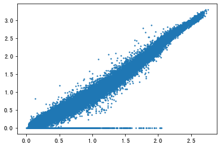
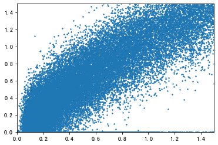
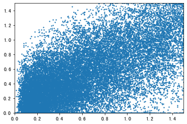
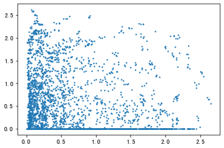
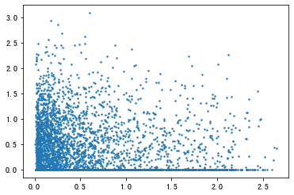
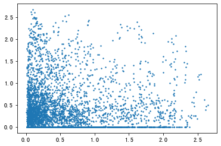
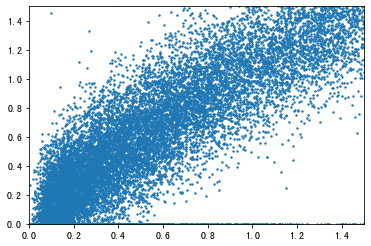

- [In-silico perturbation](#in-silico-perturbation)
  - [Material](#material)
  - [Methods](#methods)
    - [Training Process](#training-process)
    - [process the dataset](#process-the-dataset)
  - [Result](#result)
    - [Training dataset Visualization](#training-dataset-visualization)
    - [In-silico perturbation Visualization](#in-silico-perturbation-visualization)


# In-silico perturbation

## Material
NCBI dataset: https://www.ncbi.nlm.nih.gov/geo/query/acc.cgi?acc=GSE90546

Paper Adamson B, Norman TM, Jost M, Cho MY et al. A Multiplexed Single-Cell CRISPR Screening Platform Enables Systematic Dissection of the Unfolded Protein Response. Cell 2016 Dec 15;167(7):1867-1882.e21. PMID: 27984733

## Methods

### Training Process

All Catagory
{'3x_neg_ctrl_pMJ144-1',
 '3x_neg_ctrl_pMJ144-2',
 'ATF6_IRE1_pMJ152',
 'ATF6_PERK_IRE1_pMJ158',
 'ATF6_PERK_pMJ150',
 'ATF6_only_pMJ145',
 'IRE1_only_pMJ148',
 'PERK_IRE1_pMJ154',
 'PERK_only_pMJ146'}

Training Dataset
{'3x_neg_ctrl_pMJ144-1',
 'ATF6_only_pMJ145',
 'IRE1_only_pMJ148',
 'PERK_only_pMJ146'}

Test Dataset
{'ATF6_IRE1_pMJ152',
 <!-- 'ATF6_PERK_IRE1_pMJ158', -->
 'ATF6_PERK_pMJ150',
 'PERK_IRE1_pMJ154',}

### process the dataset
Use the mean value of each type of cell type
```py

test_z_genes = np.array([np.mean(adata[adata.obs['cell_type'].str.startswith('3x_neg_ctrl_pMJ144-1') ,:].X,axis=0),
np.mean(adata[adata.obs['cell_type'].str.startswith('ATF6_only_pMJ145') ,:].X,axis=0),
np.mean(adata[adata.obs['cell_type'].str.startswith('IRE1_only_pMJ148') ,:].X,axis=0),
np.mean(adata[adata.obs['cell_type'].str.startswith('PERK_only_pMJ146') ,:].X,axis=0)
])
test_z =  np.array([np.mean(adata[adata.obs['cell_type'].str.startswith('3x_neg_ctrl_pMJ144-1') ,tfs_pmbc].X,axis=0),
np.mean(adata[adata.obs['cell_type'].str.startswith('ATF6_only_pMJ145') ,tfs_pmbc].X,axis=0),
np.mean(adata[adata.obs['cell_type'].str.startswith('IRE1_only_pMJ148') ,tfs_pmbc].X,axis=0),
np.mean(adata[adata.obs['cell_type'].str.startswith('PERK_only_pMJ146') ,tfs_pmbc].X,axis=0)
])
```
## Result

### Training dataset Visualization

**reconstruction plot**



**level1 tf to genes plot**



**level3 tf to genes plot**



**tf reconstruction plots (L1 L2 L3)**







### In-silico perturbation Visualization

First I get the mean tfs value of each cell type

```py
test_z =  np.array([np.mean(adata[adata.obs['cell_type'].str.startswith('PERK_IRE1_pMJ154') ,tfs_pmbc].X,axis=0),
np.mean(adata[adata.obs['cell_type'].str.startswith('ATF6_PERK_pMJ150') ,tfs_pmbc].X,axis=0),
np.mean(adata[adata.obs['cell_type'].str.startswith('ATF6_IRE1_pMJ152') ,tfs_pmbc].X,axis=0)
])
```

Utilizing L1 tf to predict the genes will be better.

