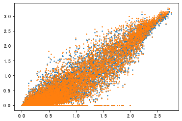
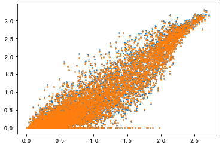

<!-- @import "[TOC]" {cmd="toc" depthFrom=1 depthTo=6 orderedList=false} -->

<!-- code_chunk_output -->

- [In-silico perturbation](#in-silico-perturbation)
  - [Material](#material)
  - [Methods](#methods)
    - [Training Process](#training-process)
    - [process the dataset](#process-the-dataset)
    - [Architecture](#architecture)
  - [Result Visualization](#result-visualization)
    - [PERK_IRE1_pMJ154](#perk_ire1_pmj154)
    - [ATF6_PERK_pMJ150](#atf6_perk_pmj150)
    - [ATF6_IRE1_pMJ152](#atf6_ire1_pmj152)
    - [ATF6_PERK_IRE1_pMJ158](#atf6_perk_ire1_pmj158)
    - [pbmc](#pbmc)
  - [Problems](#problems)
    - [UMAP](#umap)
    - [mean vs mean plot](#mean-vs-mean-plot)

<!-- /code_chunk_output -->


# In-silico perturbation 

## Material
NCBI dataset: https://www.ncbi.nlm.nih.gov/geo/query/acc.cgi?acc=GSE90546

Paper Adamson B, Norman TM, Jost M, Cho MY et al. A Multiplexed Single-Cell CRISPR Screening Platform Enables Systematic Dissection of the Unfolded Protein Response. Cell 2016 Dec 15;167(7):1867-1882.e21. PMID: 27984733

## Methods

### Training Process

All Catagory
{'3x_neg_ctrl_pMJ144-1',
 '3x_neg_ctrl_pMJ144-2',
 'ATF6_IRE1_pMJ152',
 'ATF6_PERK_IRE1_pMJ158',
 'ATF6_PERK_pMJ150',
 'ATF6_only_pMJ145',
 'IRE1_only_pMJ148',
 'PERK_IRE1_pMJ154',
 'PERK_only_pMJ146'}

Training Dataset
{'3x_neg_ctrl_pMJ144-1',
 'ATF6_only_pMJ145',
 'IRE1_only_pMJ148',
 'PERK_only_pMJ146'}

Test Dataset
{'ATF6_IRE1_pMJ152',
 'ATF6_PERK_IRE1_pMJ158',
 'ATF6_PERK_pMJ150',
 'PERK_IRE1_pMJ154',}

### process the dataset
Use the original value of each type of cell type
```py
def construct_test_dataset(cell_type):
    test_z_genes = adata[adata.obs['cell_type'].str.startswith(cell_type) ,:].X
    test_z =  adata[adata.obs['cell_type'].str.startswith(cell_type) ,tfs].X
    test_z_genes_mean_raw = np.mean(adata[adata.obs['cell_type'].str.startswith(cell_type) ,:].X,axis=0)
    return test_z_genes,test_z,test_z_genes_mean_raw
```

After get the prediction we used the mean value of original and predicted sc dastset to draw the plot.

The function for perturbation.

```py
import matplotlib.pyplot as plt
def visualization(cell_type):
    _,test_z,test_z_genes_mean_raw = construct_test_dataset(cell_type) 
    # plt.scatter(test_z_genes,pred.detach().numpy(),s=2)
    pred= model.tf12genes(torch.tensor(test_z))
    test_z_genes_mean_pred = np.mean(pred.detach().numpy(),axis=0)
    # plt.figure(1)
    plt.scatter(test_z_genes_mean_raw,test_z_genes_mean_pred,s=2)
def visualization_comparison_between_perturbation(cell_type1,cell_type2):
    _,test_z,test_z_genes_mean_raw = construct_test_dataset(cell_type1) 
    _,_,test_z_genes_mean_raw2 = construct_test_dataset(cell_type2) 
    # plt.scatter(test_z_genes,pred.detach().numpy(),s=2)
    pred= model.tf12genes(torch.tensor(test_z))
    test_z_genes_mean_pred = np.mean(pred.detach().numpy(),axis=0)
    # plt.figure(1)
    plt.scatter(test_z_genes_mean_raw2,test_z_genes_mean_raw,s=2)


```


### Architecture

I got 2 layers of tf-layer, one is after the reparameterization, after the reparameterization there is a FCNN layer we construct another tf-layer, which shows after the preturbation how the tfs will be influenced.


## Result Visualization

> Test Dataset
{'ATF6_IRE1_pMJ152',
'ATF6_PERK_IRE1_pMJ158',
'ATF6_PERK_pMJ150',
'PERK_IRE1_pMJ154'}

We show the reconstruction of genes by transcription factors in an in-silico perturbation dataset. Two visualizations are included, one comparing predicted genes with real genes (blue), and the other comparing other processed genes with real genes (orange).

### PERK_IRE1_pMJ154



### ATF6_PERK_pMJ150


### ATF6_IRE1_pMJ152


### ATF6_PERK_IRE1_pMJ158


### pbmc 

I selected any two groups of PBMC for drawing. Due to the small number of PBMC genes, I randomly selected 1000 cells and plotted their expression.

1000-cell *X AXIS* CD4T  gene expression *Y AXIS* K  gene expression


## Problems

### UMAP

pbmc umap plot


CRISPR-perturbation umap plot


### mean vs mean plot

I plot the mean gene expression of two types of single cells with different treatments, in the PBMC and in the CRISPR perturbation dataset.


*X AXIS* CD4T mean gene expression *Y AXIS* K mean gene expression


*X AXIS* ATF6_PERK_IRE1 perturbation mean gene expression *Y AXIS* control group mean gene expression


It can be seen that under different treatments in PBMC, cell expression is not very similar, while in the CRISPR-perturbation group, gene expression is very similar.

This result is validated by the umap plot.

### Gene