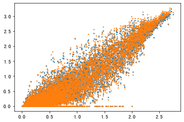
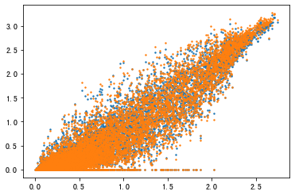

<!-- @import "[TOC]" {cmd="toc" depthFrom=1 depthTo=6 orderedList=false} -->

<!-- code_chunk_output -->

- [In-silico perturbation](#in-silico-perturbation)
  - [Material](#material)
  - [Methods](#methods)
    - [Gene chose](#gene-chose)
  - [Result Visualization](#result-visualization)
    - [PERK_IRE1_pMJ154](#perk_ire1_pmj154)
    - [ATF6_PERK_pMJ150](#atf6_perk_pmj150)
    - [ATF6_IRE1_pMJ152](#atf6_ire1_pmj152)
    - [ATF6_PERK_IRE1_pMJ158](#atf6_perk_ire1_pmj158)
  - [Gene](#gene)
  - [sveral genes concerning IRE1](#sveral-genes-concerning-ire1)

<!-- /code_chunk_output -->

# In-silico perturbation 

## Material
NCBI dataset: https://www.ncbi.nlm.nih.gov/geo/query/acc.cgi?acc=GSE90546

Paper Adamson B, Norman TM, Jost M, Cho MY et al. A Multiplexed Single-Cell CRISPR Screening Platform Enables Systematic Dissection of the Unfolded Protein Response. Cell 2016 Dec 15;167(7):1867-1882.e21. PMID: 27984733

## Methods

### Gene chose
I chose 3 genes which show difference between *ATF6_IRE1_pMJ152* and *PERK_IRE1_pMJ154* to evaluate whether using tfs to reconstruct the genes is reliable.

## Result Visualization

> Test Dataset
{'ATF6_IRE1_pMJ152',
'ATF6_PERK_IRE1_pMJ158',
'ATF6_PERK_pMJ150',
'PERK_IRE1_pMJ154'}

We show the reconstruction of genes by transcription factors in an in-silico perturbation dataset. Two visualizations are included, one comparing predicted genes with real genes (blue), and the other comparing other processed genes with real genes (orange).

### PERK_IRE1_pMJ154

### ATF6_PERK_pMJ150

### ATF6_IRE1_pMJ152

### ATF6_PERK_IRE1_pMJ158

## Gene

In this paper, the author indicated that some of the genes experienced significantly change.

I chose ATF6_IRE1_pMJ152, PERK_IRE1_pMJ154 groups to find out whether the difference genes will be reconstructed.

**Original**

**Predicted**

## sveral genes concerning IRE1

In the paper it said when the IRE1 was perturbed 3 main genes (**SEC61B SEC61A1 SEC61G**) will be suppressed, however it is not very obivious when I used the original data to construct the tsne map.

