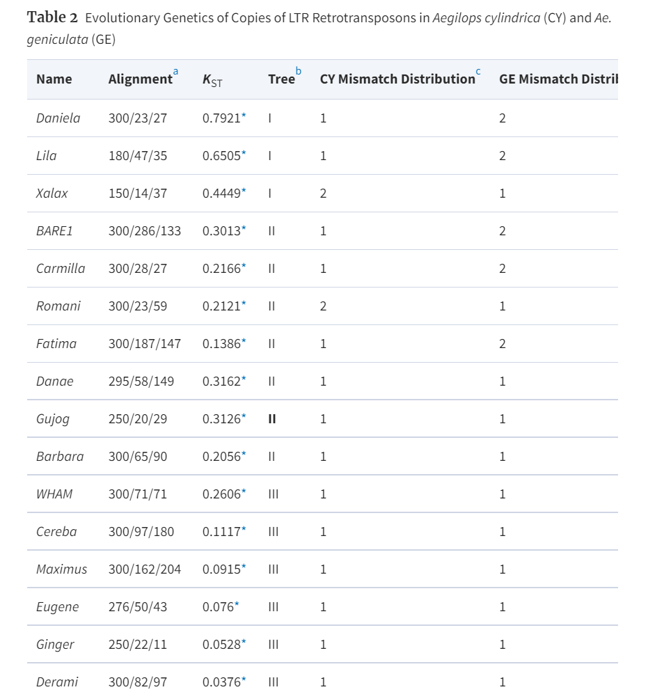

- [1/6](#16)
  - [科研-氮肥文章](#科研-氮肥文章)
    - [氮肥讨论](#氮肥讨论)
      - [堆叠图](#堆叠图)
    - [文章修改](#文章修改)
      - [安装graphpad](#安装graphpad)
      - [introduction文献](#introduction文献)
  - [1/7](#17)
    - [氮肥](#氮肥)
      - [图](#图)
      - [introduction](#introduction)
- [1/8](#18)
  - [氮肥文章](#氮肥文章)
    - [introduction](#introduction-1)
    - [p图](#p图)
      - [热图已完成](#热图已完成)
      - [箱型图](#箱型图)
- [1/9](#19)
  - [氮肥文章](#氮肥文章-1)
    - [改图](#改图)
      - [正文图](#正文图)
      - [附近文件图](#附近文件图)
- [1/10](#110)
  - [G4](#g4)
    - [LTR_finder](#ltr_finder)
    - [tmux](#tmux)
      - [安装及教程](#安装及教程)
      - [Tmux查看会话历史输出信息](#tmux查看会话历史输出信息)
    - [LTR_finder](#ltr_finder-1)
- [1/14](#114)
  - [氮肥文章](#氮肥文章-2)
    - [完成图注](#完成图注)
    - [检查文章](#检查文章)
  - [G4](#g4-1)
    - [文献阅读](#文献阅读)
      - [Gene-LTR-retrotransposons in plants: Engines of evolution](#gene-ltr-retrotransposons-in-plants-engines-of-evolution)
      - [重要信息](#重要信息)
      - [总结研究思路](#总结研究思路)
- [1/15](#115)
  - [G4](#g4-2)
    - [que 如何构建进化树](#que-如何构建进化树)
      - [step1](#step1)
    - [找失活的转座子想法](#找失活的转座子想法)
      - [step1 建树](#step1-建树)
      - [step2 分类群 测K_ST](#step2-分类群-测k_st)
      - [step3](#step3)
- [1/17](#117)
  - [BLAST](#blast)
  - [处理.ltr文件](#处理ltr文件)
- [1/19](#119)
  - [G4](#g4-3)
    - [ltr](#ltr)
      - [pipeline-TE.py完善](#pipeline-tepy完善)
        - [最终选择用Linux的知识解决](#最终选择用linux的知识解决)
- [1/20](#120)
  - [task1 对ltr的pipeline进行完善](#task1-对ltr的pipeline进行完善)
  - [已完成](#已完成)
  - [task2 根据地理位置和海拔对类群进行划分（GBE)](#task2-根据地理位置和海拔对类群进行划分gbe)
- [1/21](#121)
  - [解决海拔预测问题](#解决海拔预测问题)
- [1/22](#122)
  - [task](#task)
- [1/23](#123)
  - [对找地理位置的代码做最后优化](#对找地理位置的代码做最后优化)
  - [聚类学习](#聚类学习)
    - [什么是聚类](#什么是聚类)
    - [对聚类结果的评价](#对聚类结果的评价)
    - [距离计算](#距离计算)
    - [原型聚类](#原型聚类)
    - [学习向量化（LVQ）](#学习向量化lvq)
    - [高斯混合聚类](#高斯混合聚类)
    - [密度聚类](#密度聚类)
  - [对经纬度进行聚类](#对经纬度进行聚类)
- [1/24](#124)
  - [debug](#debug)
  - [ltr进化树](#ltr进化树)
    - [思路](#思路)
    - [代码](#代码)
- [1/26](#126)
  - [LTR_pipeline完善](#ltr_pipeline完善)
    - [debug](#debug-1)
    - [代码](#代码-1)
    - [发现问题](#发现问题)
    - [建进化树](#建进化树)
# 1/6
## 科研-氮肥文章
### 氮肥讨论
#### 堆叠图
讨论无植物和有植物的微生物排序问题
找与氮肥有关的菌的变化

先说堆叠图
再说bacilli
introduction也要加重点说bacilli


一热图加一个表
另外两个热图＋附件文件

### 文章修改
#### 安装graphpad

#### introduction文献
1 介绍bacillus
https://www.frontiersin.org/articles/10.3389/fmicb.2019.01424/full

 2 微生物搭便车现象--主要是运输链霉菌孢子
https://www.nature.com/articles/s41396-021-00952-8

3 微生物搭便车现象
https://www.cell.com/trends/microbiology/fulltext/S0966-842X(20)30267-5?rss=yes
 

 ## 1/7
 ### 氮肥
 #### 图
 两两比较 箱型图
 文件名：2to2.pzfx
 #### introduction

 paragraph1 bacillus
 
Bacillus is one of the important bacteria that hitchhiking phenomenon occurs in soil, for example, Streptomyces spores are transported to plant tissues by Streptomyces spores attach to Bacillus.

 paragraph3 

 There is clear evidence that plants shape microbiome structures, most probably by root exudates, and also that bacteria have developed various adaptations to thrive in the rhizospheric niche.  Besides, plants block a majority of microbes at the front line by a non-host resistance strategy, this natural immunity affects the growth of microbial populations in the soil. These studies suggest that plant research influences microbial communities, but no relevant studies have revealed the relationship between plants and hitchhiking.

 **植物影响微生物群落，字数不够，保证每段字数差不太多，举例说明，比如说某种菌是如何被植物影响的**

 paragraph4 
 
 研究说明：改成植物和氮肥协同作用，删掉真菌的部分

 We proposed that under the synergistic effect of nitrogen application concentration and plant, rhizosphere microbial migration and hitchhiking activities were affected, leading to changes in rhizosphere bacterial communities, and thus affecting plant growth.We present findings from a long-term longitudinal field study, in which three different nitrogen fertilizer concentrations were applied to different groups, and 0.45-μm filter membranes were utilized to prevent microbe movement through the soil. We used a molecular barcoding approach to assess bacterial diversity patterns using DNA directly extracted from bulk soil as the template to amplify the 16S rRNA gene region by PCR.Then, high-throughput sequencing of the obtained amplicons was performed to illustrate the changes in the bulk soil and rhizosphere microbial communities under different nitrogen concentrations and with or without spinach planting . Furthermore, the mechanism responsible for the effects of filter membrane applications near rhizosphere soil exposed to various nitrogen concentrations and with or without spinach planting on plant growth was investigated. We assessed the current co-occurrence network and studied the activation of the symbiotic mode under various nitrogen concentrations and with or without spinach cultivation, and we found that nitrogen concentration and with or without spinach cultivation changes influenced both motile and their associated non-motile bacteria.


**最后检查一下逻辑**


# 1/8
## 氮肥文章
### introduction
完善例子
Maize plants release a blend of metabolites, including BXs , from the roots and thereby influence the composition of the root-associated microbiota.

https://www.nature.com/articles/s41467-018-05122-7\

The composition of root exudates varies from plant to plant and affects the relative abundance of microorganisms in the vicinity of the root, plants not only can provide nutrients for microorganisms, but some plant species also contain unique antimicrobial metabolites in their exudates.  

https://academic.oup.com/femsec/article/68/1/1/572572
修改完成

### p图
#### 热图已完成
#### 箱型图
软件有问题 所以

**reason1**

Previous studies have suggested that root length and root surface area were increased under intermediate N levels and that root growth was reduced under both higher and lower fertilization levels. However, high N availability and its concomitant affect root and shoot biomass production

https://journals.plos.org/plosone/article?id=10.1371/journal.pone.0171321

Nitrogen is known to be functional in the construction of amino acids and chlorophyll, which can influence plant growth and development by affecting photosynthesis and the uptake of minerals [25,26]. 
https://www.ncbi.nlm.nih.gov/pmc/articles/PMC7024162/#!po=88.7500

Previous studies have suggested that root length and root surface area were increased under intermediate N levels and that root growth was reduced under both higher and lower fertilization levels, so that the plant morphology is affected. On the other hand, Nitrogen is be functional in the construction of amino acids and chlorophyll, which can influence plant growth and development by affecting photosynthesis and the uptake of minerals.  


# 1/9
## 氮肥文章
### 改图
#### 正文图
#### 附近文件图
**差一个12图示意图 需要具体说明膜**
**相互作用图6图**


# 1/10
## G4
### LTR_finder
安装 需要配置环境变量
1 添加环境变量
vim ~/.bashrc 
export PATH="/usr/local/nginx/sbin/:$PATH"
退出
source ~/.bashrc
### tmux
#### 安装及教程
https://www.ruanyifeng.com/blog/2019/10/tmux.html
#### Tmux查看会话历史输出信息
然后先按快捷键ctrl+b ，然后再按下[，即进入历史输出信息查看模式，可通过键盘上的上下左右键来滚动历史输出信息。
如果要退出查看模式，按下q即可。

### LTR_finder

关于LTR和LTR_retriever软件的介绍
https://www.jianshu.com/p/8fa4ef437870


# 1/14
## 氮肥文章
### 完成图注
### 检查文章
**示意图刘老师还没看（意思是一整天都没见到刘老师）**

## G4
### 文献阅读
#### Gene-LTR-retrotransposons in plants: Engines of evolution
http://dx.doi.org/10.1016/j.gene.2017.04.051

#### 重要信息
1 拟南芥中的转座子占拟南芥基因组的 14%以上

2 当转座子以相反方向插入基因内部/靠近基因产生反义转录物/通过将 TEs甲基化延伸到侧翼区域--基因沉默

3 LTR是造成 C 值悖论的主要原因

4 转座子的插入可能会导致--基因功能的改变
插入外显子/内含子；表观遗传沉默；影响转录（超过其正常的终止序列）

#### 总结研究思路


# 1/15
## G4
### que 如何构建进化树
**RAxML构建进化树** 
软件--RAxML
#### step1
文件处理
先将ltr_finder的ltr文件转为bed文件
`grep -v "Sequence" chr1.ltr |grep "Location" -B 1 |sed 's/--//g' |sed '/^$/d' |awk '{if(substr($1,1,1)=="[") {print $2} else {print $3,$5,$8}}' |sed 's/Strand://g' |tr "\n" "\t" |sed 's/+/+\n/g' |sed 's/-/-\n/g' |awk '{if(NR==1) {print "\t"$0} else {print $0}}' |sed 's/\t//1' |tr " " "\t" >chr1.bed`

该软件是对fasta文件进行处理的
需要把转座子的bed文件转成fasta文件

该bed文件不包括序列信息 所以需要利用bedtools提取对应的序列信息 并存为fasta文件
bedtools-getfasta
```bedtools getfasta -fi test.fa -bed test.bed -s -fo result.fa ```
-s 考虑链的正负方向
https://www.jianshu.com/p/5c053064fab9


### 找失活的转座子想法
#### step1 建树
以LTR各种家族为分类标准 判断不同家族的分化情况


#### step2 分类群 测K_ST
kst表示以划分的类群1和2之间的遗传分化
中间的kst值表示 物种间共享相似的TE拷贝


#### step3 
具有混合物种进化枝（树 IV）和低K ST的ML树
表明物种分化期间的该LTR家族的静止


# 1/17
## BLAST
+ 用于序列分析，同源的数据库搜索软件
+ BLAST软件包可以 用于
  + BLASTP 蛋白质序列 vs 蛋白质库
  + **BLASTN** DNA序列 vs DNA库
  + BLASTX DNA序列 vs 蛋白质库
+ 和FASTA比较 BLAST比较快

## 处理.ltr文件
+ 将ltr转为bed文件
+ 源代码
```python
from cgi import test
from imghdr import tests
from tkinter import W
import re

def ltr_bed(ltrfile,bedfile):
    ltrfile=open(ltrfile,'r')
    bedfile=open(bedfile,'w')
    i=0
    a=0
    q=0
    chrname=[]
    startnumber=[]
    endnumber=[]
    style=[]
    pattern0 ='(?<=chr).[0-9]*'
    pattern1 = '(?<=Location : ).[0-9]*'
    pattern2 = '(?<= - ).[0-9]*'
    pattern3 = '(?<=Strand:).[0-9]*'
    for line in ltrfile:
        # 把line分割为每个转座子信息为一个字符串 line.split("--")
        # re.search()扫描整个字符串并返回第一个成功的匹配。
        # 以空格为分隔符 提取chrx
        if 'chr'in line:
            chrname.append(re.findall(pattern0, line))
            test0 = "".join(chrname[q])
            bedfile.write('chr'+test0+'-'+str(a+1)+'  ')
            q=q+1

        m='Location'
        if m in line:
            # 正则表达式处理
            startnumber.append(re.findall(pattern1, line))
            test1 = "".join(startnumber[a])
            bedfile.write(test1+'  ')

            endnumber.append(re.findall(pattern2, line)[0])
            test2 = "".join(endnumber[a])
            bedfile.write(test2+'  ')

            style.append(re.findall(pattern3, line))
            test3 = "".join(style[a])
            bedfile.write(test3+'\n')
            a=a+1
        i=i+1     
    ltrfile.close
    bedfile.close

if __name__ == '__main__':
    ltrfile="/home/ubuntu/Arabidopsis/Arabidopsis_sequence/An-1/test.ltr"
    bedfile="/home/ubuntu/Arabidopsis/Arabidopsis_sequence/An-1/1x.bed"
    ltr_bed(ltrfile,bedfile)          
```

+ 测试输出结果
染色体-转座子号 起始位点 结束位点 正/负链
chr1-1  179795  184613  -
chr1-2  255305  264911  -
chr1-3  435375  443647  +
chr1-4  530597  536514  +
chr1-5  530597  536882  +
chr1-6  530597  537224  +
chr1-7  530597  537848  -

+ 写代码遇到的问题 
  + 对```for line in file```不够熟悉
  + 该操作是对每行进行读取，一行一行的读，把整个文件扫一遍，理解有误
  + 对正则表达式不够熟练，``` '(?<= - ).[0-9]*'```


# 1/19
## G4
### ltr
#### pipeline-TE.py完善
```python
from cgi import test
from imghdr import tests
from platform import system
from tkinter import W
import re
import os


# 处理ltr文件  ltr-bed
def ltr_bed(ltrfile,bedfile):
    ltrfile=open(ltrfile,'r')
    bedfile=open(bedfile,'w')
    i=0
    a=0
    q=0
    # chrid=[]
    chrname=[]
    startnumber=[]
    endnumber=[]
    style=[]
    pattern0 ='(?<=chr).[0-9]*'
    pattern1 = '(?<=Location : ).[0-9]*'
    pattern2 = '(?<= - ).[0-9]*'
    pattern3 = '(?<=Strand:).[0-9]*'
    for line in ltrfile:
        # 把line分割为每个转座子信息为一个字符串 line.split("--")
        # re.search()扫描整个字符串并返回第一个成功的匹配。
        # 以空格为分隔符 提取chrx
        if 'chr' in line:

            chrname.append(re.findall(pattern0, line))

            test0 = "".join(chrname[q])
            bedfile.write('chr'+test0+'\t')
            q=q+1

        m='Location'
        if m in line:
        # if (line.split("--")[i].find("str") != -1): 
            # 正则表达式处理   
            
            startnumber.append(re.findall(pattern1, line))
            test1 = "".join(startnumber[a])
            bedfile.write(test1+'\t')

            endnumber.append(re.findall(pattern2, line)[0])
            test2 = "".join(endnumber[a])
            bedfile.write(test2+'\t')

            style.append(re.findall(pattern3, line))
            test3 = "".join(style[a])
            bedfile.write(test3+'\n')
            a=a+1
            # test = "".join(chrname[q-1])
            # bedfile.write('chr'+test+'-'+str(a+1) +'\n')
        i=i+1     
    ltrfile.close
    bedfile.close

def modifyfasta(fastafile,fastafile1):
    chrname=[]
    chrnumber1=[]
    chrnumber2=[]
    q=0

    fastafile = open(fastafile,'r')   
    fastafile1 = open(fastafile1,'w') 
    i=1
   
    find0='(?<=:).[0-9]*'
    find1='(?<=-).[0-9]*'
    pattern1 ='(?<=chr).[0-9]*'

    for line in fastafile:
        if line.startswith('>'):
            # step1 提取chr后的染色体数
            chrname.append(re.findall(pattern1, line))
            test1 = "".join(chrname[q])
            fastafile1.write('>'+'chr'+test1+'-'+str(i)+':')

            chrnumber1.append(re.findall(find0, line))
            chrnumber2.append(re.findall(find1, line))
            test3="".join(chrnumber1[q])
            test4="".join(chrnumber2[q])
            fastafile1.write(test3+'-'+test4+'()'+'\n')
            
            i=i+1
            q=q+1
            continue
       
        fastafile1.write(line)
    fastafile.close()
    fastafile1.close()


if __name__ == '__main__':
    chr_fastafile="/home/ubuntu/Arabidopsis/Arabidopsis_sequence/An-1/chr1.fa"
    ltrfile="/home/ubuntu/Arabidopsis/Arabidopsis_sequence/An-1/test.ltr"
    bedfile="/home/ubuntu/Arabidopsis/Arabidopsis_sequence/An-1/1x.bed"
    fastafile="/home/ubuntu/Arabidopsis/Arabidopsis_sequence/An-1/resultx.fa"
    fastafile1="/home/ubuntu/Arabidopsis/Arabidopsis_sequence/An-1/resultx-modify.fa"
    ltr_identify="/home/ubuntu/Arabidopsis/Arabidopsis_sequence/An-1/ltr_identify.out"
    # step1 将ltr文件转为bed文件 
    ltr_bed(ltrfile,bedfile) 
    # step2 将bed文件转为fasta文件 - getfasta
    os.system("bedtools getfasta -fi "+chr_fastafile+" -bed "+bedfile+" -s -fo "+fastafile)
    # step3 将fasta文件进行一些处理 使得最终ltr的命名以chr染色体号-第几个ltr转座子
    modifyfasta(fastafile,fastafile1)
    # step4 对ltr进行balst操作
    os.system("blastn -query "+fastafile1+" -db /home/ubuntu/data/softwares/tedb -outfmt 6 > "+ltr_identify)
    # step4 处理blastn后的文件
    # que：选择哪一个类别作为该ltr的最终类别？
    

```

+ blastn结果
```xml
chr1-3:435375-443647()	AT3TE36695|-|8752366|8752789|SIMPLEGUY1|DNA/Harbinger|424	82.963	135	10	5	2644	2765	222	88	1.36e-22	110
chr1-3:435375-443647()	AT1TE96850|+|29611562|29611719|TAG2|DNA/HAT|158	85.526	152	20	2	2384	2535	1	150	4.78e-37	158
chr1-3:435375-443647()	AT1TE53880|-|16351341|16351942|SIMPLEGUY1|DNA/Harbinger|602	75.749	367	57	18	2564	2923	423	82	1.72e-36	156
chr1-3:435375-443647()	AT2TE10335|+|2233114|2233258|TAG2|DNA/HAT|145	86.275	153	7	4	2977	3129	1	139	6.18e-36	154
chr1-3:435375-443647()	AT3TE41760|-|10031935|10031978|SIMPLEGUY1|DNA/Harbinger|44	100.000	44	0	0	2921	2964	44	1	2.96e-14	82.4
chr1-4:530597-536514()	AT1TE01710|+|529161|529576|HELITRON4|RC/Helitron|416	99.475	381	2	0	5120	5500	1	381	0.0	693
chr1-4:530597-536514()	AT1TE01710|+|529161|529576|HELITRON4|RC/Helitron|416	100.000	34	0	0	5583	5616	383	416	7.66e-09	63.9
chr1-5:530597-536882()	AT1TE01710|+|529161|529576|HELITRON4|RC/Helitron|416	99.475	381	2	0	5120	5500	1	381	0.0	693
chr1-5:530597-536882()	AT1TE01710|+|529161|529576|HELITRON4|RC/Helitron|416	100.000	34	0	0	5583	5616	383	416	8.14e-09	63.9
chr1-6:530597-537224()	AT1TE01710|+|529161|529576|HELITRON4|RC/Helitron|416	99.475	381	2	0	5120	5500	1	381	0.0	693
chr1-6:530597-537224()	AT1TE01710|+|529161|529576|HELITRON4|RC/Helitron|416	100.000	34	0	0	5583	5616	383	416	8.58e-09	63.9
chr1-7:530597-537848()	AT1TE01710|+|529161|529576|HELITRON4|RC/Helitron|416	99.475	381	2	0	5120	5500	1	381	0.0	693
chr1-7:530597-537848()	AT1TE01710|+|529161|529576|HELITRON4|RC/Helitron|416	100.000	34	0	0	5583	5616	383	416	9.39e-09	63.9
```
+ pipeline遗留问题：选择哪一个类别作为该ltr的最终类别？
  + 对identify.out文件的处理
  + 是选择分数最低的（可能性最高）的作为最终类别还是可能的都计算1遍
+ blsatn结果
  + 选择最低
  + E Value 值越小，越可信，相对的一个统计值
  + 参考代码
``` python 
  #!/usr/bin/python3
import sys
### 脚本中指定输入和输出文件
# infile = file1 
# outfile = file2
### 在终端中指定输入和输出文件
infile = sys.argv[1] # 输入的 Blast 结果形式是 -outfmt "7 qacc sacc score evalue pident qcovs ppos"
outfile  = sys.argv[2]

outF = open(outfile,'w')
outF.write('%s\t%s\t%s\t%s\t%s\t%s\t%s\t%s\t%s\t%s\n' % ('Blast version','Query','Database','The number of \"hits found\"','Subject','Score','Evalue','Identity','Query coverage per subject','Postives'))#

RowNumber = 1
with open(infile) as inF:
    for line in inF:
        if line[0:7] == '# BLAST':
            if RowNumber > 1:
                templine = templine0
                RowNumber = 1
                templine0 = []
                templine0.append(line)
                if templine[3].strip()[0:9] == '# Fields:':
                    blastVersion = templine[0].strip()[2:]
                    query = templine[1].strip()[8:]
                    database = templine[2].strip()[11:]
                    numberHits = templine[4].strip().split()[1]
                    """
                    # 该注释部分是用于提取 Hit 上的所有行，如果需要提取所有结果，只需要把此处注释去掉，下面 subject ... outF.write 的7行注释掉即可。
                    for i in range(5,len(templine)):
                    	subject = templine[i].strip().split('\t')[1]
                        score = templine[i].strip().split('\t')[2]
                        evalue = templine[i].strip().split('\t')[3]
                        identity = templine[i].strip().split('\t')[4]
                        queryPerSubject = templine[i].strip().split('\t')[5]
                        positive = templine[i].strip().split('\t')[6]
                        outF.write('%s\t%s\t%s\t%s\t%s\t%s\t%s\t%s\t%s\t%s\n' % 
                                (blastVersion,query,database,numberHits,subject,score,evalue,identity,queryPerSubject,positive))
                     """
                    subject = templine[5].strip().split('\t')[1]
                    score = templine[5].strip().split('\t')[2]
                    evalue = templine[5].strip().split('\t')[3]
                    identity = templine[5].strip().split('\t')[4]
                    queryPerSubject = templine[5].strip().split('\t')[5]
                    positive = templine[5].strip().split('\t')[6]
                    outF.write('%s\t%s\t%s\t%s\t%s\t%s\t%s\t%s\t%s\t%s\n' % 
                                (blastVersion,query,database,numberHits,subject,score,evalue,identity,queryPerSubject,positive))
                else:
                    continue
            RowNumber = 1
            templine0 = []
            templine0.append(line)
        else:
            RowNumber += 1
            templine0.append(line)

```

##### 最终选择用Linux的知识解决
  + blast的-outfmt 6格式默认最上面的比对到的evalue最小，因此可以利用awk根据第一列去重，默认会保留最上面的一条记录，即evalue最小值
  ```sh
  awk '!a[$1]++{print}' 1.blast > uniq.blast
  ```
  + 疑问:lte_identify.xml文件中的E-value值有为负数，但是在最终处理判断时并没有将其留下，而是取了E-value=0.0的一行，例如E-value=1.17e-105
  + 此外，有的E-value十分奇怪，例如8.14e-09，意思是？
  + 对结果进行简单测试：并不是单纯提取第一条记录 测试1通过；但是对e值得判断情况仍存疑，需要进一步测试


# 1/20
## task1 对ltr的pipeline进行完善
+ 最终的xml文件信息应该包括：类群的编号 chr染色体-ltr编号 转座子家族名称
+ 例：6898  chr1-1	LTR/Copia
## 已完成 
+ 注意事项：
  + 对正则表达式的处理
    + |是特殊的字符，‘|’ 操作符绝不贪婪。 如果要匹配 ‘|’ 字符，使用 |， 或者把它包含在字符集里，比如 [|].
  ```python
  def infoget(group_number,outfile, ltr_family_getfile):
    infile=open(outfile,'r')
    famliy=[]
    q=0
    outfile1=open(ltr_family_getfile,'w')
    pattern0=r'[|](.*?)[|]'
    for line in infile:
        outfile1.write(str(group_number)+'\t')
        # 拆分每一行的数  split
        splitresult=line.split('\t')
        test0 = "".join(splitresult[0])
        outfile1.write(test0+'\t')
        # 提取ltr家族名称
        test1 = "".join(splitresult[1])
        test2=test1[::-1]
        famliy.append(re.findall(pattern0, test2)[0])
        test3 = "".join(famliy[q])
        test4=test3[::-1]
        outfile1.write(test4+'\n')
        q=q+1
    infile.close()
    outfile1.close()  
    ```
+ 对函数进行修改
```python
def modifyfasta(fastafile,fastafile1):
    chrname=[]
    q=0

    fastafile = open(fastafile,'r')   
    fastafile1 = open(fastafile1,'w') 
    i=1
   
    # find0='(?<=:).[0-9]*'
    # find1='(?<=-).[0-9]*'
    pattern1 ='(?<=chr).[0-9]*'

    for line in fastafile:
        if line.startswith('>'):
            # step1 提取chr后的染色体数
            chrname.append(re.findall(pattern1, line))
            test1 = "".join(chrname[q])
            fastafile1.write('>'+'chr'+test1+'-'+str(i)+'\n')

            # chrnumber1.append(re.findall(find0, line))
            # chrnumber2.append(re.findall(find1, line))
            # test3="".join(chrnumber1[q])
            # test4="".join(chrnumber2[q])
            # fastafile1.write(test3+'-'+test4+'()'+'\n')
            
            i=i+1
            q=q+1
            continue
       
        fastafile1.write(line)
    fastafile.close()
    fastafile1.close()
```
    
## task2 根据地理位置和海拔对类群进行划分（GBE)
+ 将海拔信息加在H列
+ 前两列为经度和纬度
+ 参考资料：https://www.cuoshuo.com/blog/309714.html
``` python 
import requests
import pandas as pd

# script for returning elevation from lat, long, based on open elevation data
# which in turn is based on SRTM
def get_elevation(lat, long):
    query = ('https://api.open-elevation.com/api/v1/lookup'
             f'?locations={lat},{long}')
    r = requests.get(query).json()  # json object, various ways you can extract value
    # one approach is to use pandas json functionality:
    elevation = pd.io.json.json_normalize(r, 'results')['elevation'].values[0]
    return elevation

get_elevation(46.3716, 11.2376)
``` 
+ 对代码进行初步测试 海拔高度与Google Earth的结果相差在5m以内
+ 仍需完善的部分
  + 导入csv文件 自动读取经度和纬度
  + 调用get_elevation函数，获得高度的信息
  + 插入到纬度后一列


# 1/21
## 解决海拔预测问题
+ 痛苦的一下午 尝试了多种方法 终于成功了！
+ 最终代码
+ 
``` python
import requests
import pandas as pd

# script for returning elevation from lat, long, based on open elevation data
# which in turn is based on SRTM
def get_elevation(lat, long):
    query = ('https://api.open-elevation.com/api/v1/lookup'
             f'?locations={lat},{long}')
    r = requests.get(query).json()  # json object, various ways you can extract value
    # one approach is to use pandas json functionality:
    elevation = pd.io.json.json_normalize(r, 'results')['elevation'].values[0]
    return elevation
```

``` python 
import csv
# 按列写入csv
# 参数一 准备写入的数据 ['title','data1','data2',...]
# 参数二 首次写入的数据 ['title','data1','data2',...]


def write_excel(datas, first=False):
 
	if first:
		rows = zip(datas)
		with open('/home/ubuntu/Arabidopsis/Scripts/accessions.csv', "w", newline='') as f:
			writer = csv.writer(f)
			for row in rows:
				writer.writerow(row)
 
	else:
		with open('/home/ubuntu/Arabidopsis/Scripts/accessions.csv', 'r') as csvFile:
			rows = csv.reader(csvFile)

			with open('/home/ubuntu/Arabidopsis/Scripts/accessions2.csv','w', newline='') as f:
				writer = csv.writer(f)
				i = 0
				for row in rows:
					row.append(datas[i])
					i = i + 1
					writer.writerow(row,dialect='/t')
 
		# 删除原表和重命名
		os.remove('/home/ubuntu/Arabidopsis/Scripts/accessions.csv')
		os.rename('/home/ubuntu/Arabidopsis/Scripts/accessions2.csv','/home/ubuntu/Arabidopsis/Scripts/accessions.csv')

data_csv='/home/ubuntu/Arabidopsis/Scripts/accessions.csv'
data_csv = pd.read_csv(data_csv,delimiter="\t") # 读取刚才写入的文件
i=0
data=[]
data.append("ali")
while i<1134:
	lat=data_csv.iloc[i][5]
	long=data_csv.iloc[i][6]
	data.append(get_elevation(lat, long))
	i=i+1
write_excel(data, first=False)

```
+ 代码缺陷
  + 由于不需要很高的复用性 因此并没有将代码完善得很优雅
  + API只提供100次免费服务，所以说一次只能跑500个类群的数据，因此，对于更多的类群，必须将其分解为不同的请求
  + 需要的时间很长，但这应该是正常现象，如果是其他方法，应该依旧需要比较长的时间
  + 代码时好时坏，暂时没有找到问题，目前只跑了四百多个w
   


# 1/22
## task
+ 进化树可视化（参考文章GBE）
  + 如何做到可视化的？
  + 进化树如何构建的

+ 聚类
  + 根据经纬度 高度 三个变量对1135个拟南芥类群做聚类分析
  + 根据经纬度 两个变量对1135个拟南芥类群做聚类分析


# 1/23
## 对找地理位置的代码做最后优化
``` python 
import requests
import pandas as pd
# script for returning elevation from lat, long, based on open elevation data
# which in turn is based on SRTM
def get_elevation(lat, long):
    query = ('https://api.open-elevation.com/api/v1/lookup'
             f'?locations={lat},{long}')
    r = requests.get(query).json()  # json object, various ways you can extract value
    # one approach is to use pandas json functionality:
    elevation = pd.io.json.json_normalize(r, 'results')['elevation'].values[0]
    return elevation


data_csv='/home/ubuntu/Arabidopsis/Scripts/AA.txt'
data_csv= open(data_csv,"r")
outfile=open('/home/ubuntu/Arabidopsis/Scripts/accessions.txt','w')

for line in data_csv:
    lat=line.split('\t')[0]
    long=line.split('\t')[1]
    test0=str(get_elevation(lat, long))
    outfile.write(test0+'\n')
```

## 聚类学习
### 什么是聚类
+ 无监督学习（大部分
+ 对样本进行训练
+ 目的：分类

### 对聚类结果的评价
+ 性能度量
  + 外部指标
    + 有参考模型，是将聚类的结果和参考模型进行对比
    + a=|SS| b=|SD| c=|DS| d=|DD|
    + S：相似  D：不相似
    + 由四个数算出JC系数 FM指数 Rand指数
    + 以上三个数 越大则说明 聚类结果越好
  + 内部指标
    + 算出簇内样本平均距离 簇内样本最大距离 簇间样本最小距离 簇间中心距离
    + 有以上四个数算出 DB指数 Dunn指数 
    + DB越小 Dunn越大 说明越好

### 距离计算
+ 有序属性
  + 闵可夫斯基距离/欧氏距离
  + 曼哈顿距离：街区距离
  + 切比雪夫距离：“横坐标距离”
+ 非度量距离

### 原型聚类
原型向量指的就是刚开始选择的样本点
**中心思想：迭代**
+ k-means（k均值算法）
  + 先随机选择k个样本点（k为簇的数量）
  + 将这k个样本作为均值向量
  + 对所有的样本进行划分
  + 再由簇进行计算平均值
  + 得到新的样本中心点
  + 以此迭代
  
### 学习向量化（LVQ）
+ 监督式学习
+ 每个样例都有标签
+ 和k-means的区别在于 有标签
+ 因此找到与原型最近的样本点
+ 当标签一致时 原型向样本的方向移动 反之远离
+ 以此迭代
+ 输出值为原型向量 最后以两个点之间的垂直平分线对簇进行划分

### 高斯混合聚类
+ 混合的意思是 由多个高斯模型构成（正态分布）
+ 多个高斯分布 但合起来并不是高斯模型
+ 划分标准是 以概率模型来表达聚类原型
+ 更可能在哪一个高斯模型里

### 密度聚类
+ 特点：簇的个数是未知的
+ 根据样本分布的紧密程度来确定类的划分
+ 会出现噪点

层次聚类
+ 长得很像进化树
+ 可以自顶向下 也可以自底向上


## 对经纬度进行聚类
+ 参考资料
  + https://blog.csdn.net/qq_43741312/article/details/97128745
    + 参考主要代码
  + https://blog.csdn.net/qq_43741312/article/details/97128745
    + 参考数据存储和文件的导入
+ 参考代码1
``` python
import random
import pandas as pd
import numpy as np
import matplotlib.pyplot as plt

# 计算欧拉距离
def calcDis(dataSet, centroids, k):
    clalist=[]
    for data in dataSet:
        diff = np.tile(data, (k, 1)) - centroids  #相减   (np.tile(a,(2,1))就是把a先沿x轴复制1倍，即没有复制，仍然是 [0,1,2]。 再把结果沿y方向复制2倍得到array([[0,1,2],[0,1,2]]))
        squaredDiff = diff ** 2     #平方
        squaredDist = np.sum(squaredDiff, axis=1)   #和  (axis=1表示行)
        distance = squaredDist ** 0.5  #开根号
        clalist.append(distance) 
    clalist = np.array(clalist)  #返回一个每个点到质点的距离len(dateSet)*k的数组
    return clalist

# 计算质心
def classify(dataSet, centroids, k):
    # 计算样本到质心的距离
    clalist = calcDis(dataSet, centroids, k)
    # 分组并计算新的质心
    minDistIndices = np.argmin(clalist, axis=1)    #axis=1 表示求出每行的最小值的下标
    newCentroids = pd.DataFrame(dataSet).groupby(minDistIndices).mean() #DataFramte(dataSet)对DataSet分组，groupby(min)按照min进行统计分类，mean()对分类结果求均值
    newCentroids = newCentroids.values
 
    # 计算变化量
    changed = newCentroids - centroids
 
    return changed, newCentroids

# 使用k-means分类
def kmeans(dataSet, k):
    # 随机取质心
    centroids = random.sample(dataSet, k)
    
    # 更新质心 直到变化量全为0
    changed, newCentroids = classify(dataSet, centroids, k)
    while np.any(changed != 0):
        changed, newCentroids = classify(dataSet, newCentroids, k)
 
    centroids = sorted(newCentroids.tolist())   #tolist()将矩阵转换成列表 sorted()排序
 
    # 根据质心计算每个集群
    cluster = []
    clalist = calcDis(dataSet, centroids, k) #调用欧拉距离
    minDistIndices = np.argmin(clalist, axis=1)  
    for i in range(k):
        cluster.append([])
    for i, j in enumerate(minDistIndices):   #enymerate()可同时遍历索引和遍历元素
        cluster[j].append(dataSet[i])
        
    return centroids, cluster
 
# 创建数据集
def createDataSet():
    return [[1, 1], [1, 2], [2, 1], [6, 4], [6, 3], [5, 4]]

if __name__=='__main__': 
    dataset = createDataSet()
    centroids, cluster = kmeans(dataset, 2)
    print('质心为：%s' % centroids)
    print('集群为：%s' % cluster)
    for i in range(len(dataset)):
      plt.scatter(dataset[i][0],dataset[i][1], marker = 'o',color = 'green', s = 40 ,label = '原始点')
                                                    #  记号形状       颜色      点的大小      设置标签
      for j in range(len(centroids)):
        plt.scatter(centroids[j][0],centroids[j][1],marker='x',color='red',s=50,label='质心')
        plt.show()

```

+ 参考代码2
``` python
#导入相应的包
import scipy
import scipy.cluster.hierarchy as sch
from scipy.cluster.vq import vq,kmeans,whiten
import numpy as np
import matplotlib.pylab as plt

#待聚类的数据点,cancer.csv有653行数据,每行数据有11维: 
dataset = np.loadtxt('cancer.csv', delimiter=",")
#np数据从0开始计算，第0维维序号排除，第10维为标签排除，所以为1到9
points = dataset[:,1:9]
cancer_label = dataset[:,10]
print "points:\n",points
print "cancer_label:\n",cancer_label
# k-means聚类
#将原始数据做归一化处理
data=whiten(points)
#使用kmeans函数进行聚类,输入第一维为数据,第二维为聚类个数k.
#有些时候我们可能不知道最终究竟聚成多少类,一个办法是用层次聚类的结果进行初始化.当然也可以直接输入某个数值. 
#k-means最后输出的结果其实是两维的,第一维是聚类中心,第二维是损失distortion,我们在这里只取第一维,所以最后有个[0]
#centroid = kmeans(data,max(cluster))[0]  
centroid = kmeans(data,2)[0]
print centroid
#使用vq函数根据聚类中心对所有数据进行分类,vq的输出也是两维的,[0]表示的是所有数据的label
label=vq(data,centroid)[0]
num = [0,0]
for i in label:
    if(i == 0):
        num[0] = num[0] + 1
    else:
        num[1] = num[1] + 1
print 'num =',num       
#np.savetxt('file.csv',label)
print "Final clustering by k-means:\n",label
result = np.subtract(label,cancer_label)
print "result:\n",result

count = [0,0]
for i in result:
    if(i == 0):
        count[0] = count[0] + 1
    else:
        count[1] = count[1] + 1
print count
print float(count[1])/(count[0]+count[1])
```


# 1/24
## debug
+ python 在循环中使用list.append（list）后面会覆盖前面的解决方法
  + 原因：因为append时，listA的内存地址并没有变，所以list在更新后，所有元素全都变成了listA的当前值
  + 源代码
``` python 
 infile=open(infile,'r')
    data2=[]
    data1=[0,0]
    i=0
    for line in infile:
       
        data1[0]=eval(line.split('\t')[1])
        data1[1]=eval(line.split('\t')[2])
        # data1[2]=line.split('\t')[3]
        data2.append(data1)
```
  + 修改代码
``` python 
 infile=open(infile,'r')
    data2=[]
   
    i=0
    for line in infile:
        data1=[0,0]
        data1[0]=eval(line.split('\t')[1])
        data1[1]=eval(line.split('\t')[2])
        # data1[2]=line.split('\t')[3]
        data2.append(data1)
```
  + 将data1的定义放在循环里面


## ltr进化树
### 思路
+ 对类群进行分类
  + 暂定先用经纬度分为两个类别
  + 再加海拔信息进行分类
  + 再细分（需要商讨）
+ 传入类群信息（将各个path写在一个txt里作为参数传入，以便后续能够传入多个类群的bed/fasta文件的路径）
+ 对于每一个类群 提取相同家族的ltr
+ 再对同一类别的同一ltr家族做建树

### 代码
``` python


# 输出为多个文件 分几类就输出几个文件
# 假设分两类

def group_classification(grop_csv):
    infile=open(grop_csv,'r')
    outfile1=('/home/ubuntu/Arabidopsis/Scripts/group_classification1.txt','w')
    outfile2=('/home/ubuntu/Arabidopsis/Scripts/group_classification1.txt','w')
    


# 规定datafile提供类群的路径 例如：/home/ubuntu/Arabidopsis/Arabidopsis_sequence/An-1
# 传入存有分类后各个类群的path和类群个数
# lltr_famliy_name为需要的ltr家族的名字
# 对一个类群进行处理
def famliy_ditinct(filepath,ltr_famliy_name):
    i=0
    p=1
    path0='/home/ubuntu/Arabidopsis/Scripts'

    i=len(ltr_famliy_name)
    while p<=5:
        ltr_resultfile=open(filepath+'chr'+p+'.xml','r')
        for line in ltr_resultfile:
            i=0
            while i <len(ltr_famliy_name):
                if str(ltr_famliy_name[i]) in line:
                    filename=path0+'/ltr_famliy_result'+str(ltr_famliy_name[i]+'.txt')
                    f=open( filename,'w')
                    f.write(line+'\n')
                    i=i+1
        p=p+1
    


if __name__ == '__main__':
    ltr_famliy_name=['LTR/Copia','DNA/Harbinger','RC/Helitron']
    grop_csv='包含1135拟南芥的地理位置等信息的文件'
    datafile=''
    o=1
    q=0
    group_classification(grop_csv)
    # 对classification o 进行处理
      classificationfile=('/home/ubuntu/Arabidopsis/Scripts/group_classification'+o+'.txt','r')
      for line in classificationfile:
          famliy_ditinct(line,ltr_famliy_name)
      
```


  # 1/26
  ## LTR_pipeline完善
  ### debug
  + ```linecache.getline(fastafile, linenumber).strip()```
    + 报错：_io.TextIOWrapper‘ object has no attribute 
    + 解决方案：filename应该是path，而不是```open（path,'r')```
    + 代码修改：``` fastafile=open(filepath+'/chr'+str(p)+'-ltr'+'.fa','r`)``` 改为 ```fastafile=filepath+'/chr'+str(p)+'-ltr'+'.fa'```
  + path出错
    + 缺少/的问题
  + ```open(file,'ww)```导致文件内容背覆盖
    + “w”代表每次运行都覆盖文件内容
    + 将‘w’改为‘a’即可

### 代码
``` python 

# 输出为多个文件 分几类就输出几个文件
# 假设分两类
from posixpath import split
from sklearn.metrics import classification_report
import linecache


def group_classification(grop_csv):
    infile=open(grop_csv,'r')
    outfile1=open('/home/ubuntu/Arabidopsis/Scripts/group_classification1.txt','w')
    outfile2=open('/home/ubuntu/Arabidopsis/Scripts/group_classification1.txt','w')
    


# 规定datafile提供类群的路径 例如：/home/ubuntu/Arabidopsis/Arabidopsis_sequence/An-1
# 传入存有分类后各个类群的path和类群个数
# lltr_famliy_name为需要的ltr家族的名字
# 对一个类群进行处理
def famliy_ditinct(filepath,ltr_famliy_name,ltr_famliy_name_modify):
    i=0
    p=1
    path0='/home/ubuntu/Arabidopsis/Scripts/'
    
    i=len(ltr_famliy_name)

    # 测试 1条染色体
    while p<=1:
        ltr_resultfile=open(filepath+'/chr'+str(p)+'-ltr'+'.xml','r')
        fastafile=filepath+'/chr'+str(p)+'-ltr'+'.fa'
        linenumber=2
        for line in ltr_resultfile:   
            i=0
            while i <len(ltr_famliy_name):
                if str(ltr_famliy_name[i]) in line:
                    data = linecache.getline(fastafile, linenumber)
                    filename=path0+'ltr_famliy_result-'+str(ltr_famliy_name_modify[i])+'.fa'
                    f=open( filename,'a')
                    f.write('>'+str(line.split('\t')[0])+'\t'+str(line.split('\t')[1])+'\n'+str(data))
                    f.close()
                    break
                i=i+1
            linenumber+=2
        p=p+1
    


if __name__ == '__main__':
    ltr_famliy_name=['LTR/Copia','DNA/Harbinger','RC/Helitron']
    ltr_famliy_name_modify=['LTR-Copia','DNA-Harbinger','RC-Helitron']
    grop_csv='包含1135拟南芥的地理位置等信息的文件'
    datafile=''
    o=1
    q=0
    # group_classification(grop_csv)

    # 对classification o 进行处理 
    classificationfile=open('/home/ubuntu/Arabidopsis/Scripts/group_classification'+str(o)+'.txt','r')
    for line in classificationfile:
        filepath=line.split()[0]
        famliy_ditinct(filepath,ltr_famliy_name,ltr_famliy_name_modify)
```

### 发现问题
+ blastn操作
  + ``` blastn -query +chr1-ltr.fa+ -db /home/ubuntu/data/softwares/tedb -outfmt 6```
  + blastn操作后 ltrfinder的结果有的无法在ltr家族库里找到
  + 意思是问题不大（）
  
```xml
chr1-6  AT1TE01710|+|529161|529576|HELITRON4|RC/Helitron|416    99.475  381     2       0       1792    2172    1       381     0.0     693
chr1-6  AT1TE01710|+|529161|529576|HELITRON4|RC/Helitron|416    100.000 34      0       0       2255    2288    383     416     8.33e-09       63.9
chr1-10 AT3TE48480|+|11664969|11669787|ATCOPIA63|LTR/Copia|4819 99.762  3789    9       0       1       3789    2       3790    0.0     6948
chr1-10 AT3TE48480|+|11664969|11669787|ATCOPIA63|LTR/Copia|4819 99.789  948     2       0       3788    4735    3872    4819    0.0     1740
chr1-10 AT3TE48480|+|11664969|11669787|ATCOPIA63|LTR/Copia|4819 100.000 374     0       0       4362    4735    1       374     0.0     691
chr1-10 AT3TE48480|+|11664969|11669787|ATCOPIA63|LTR/Copia|4819 100.000 373     0       0       1       373     4447    4819    0.0     689
```

### 建进化树
+ 多序列特征比对
建树需要保证序列长短一致
+ 建立ML树
是对同一家族的ltr序列进行建树 因此序列之间相似性比较高 用最大似然法（ML）
    